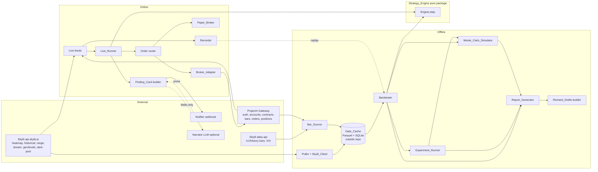
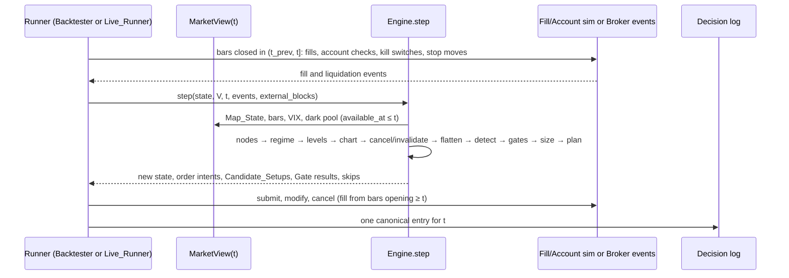
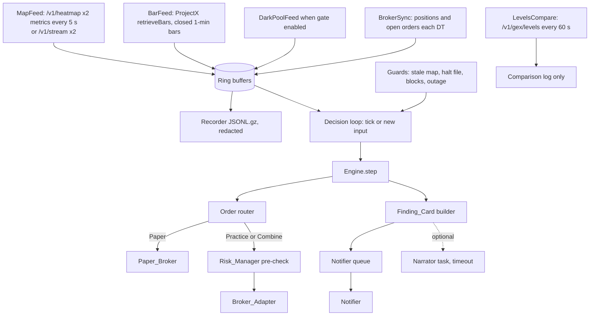
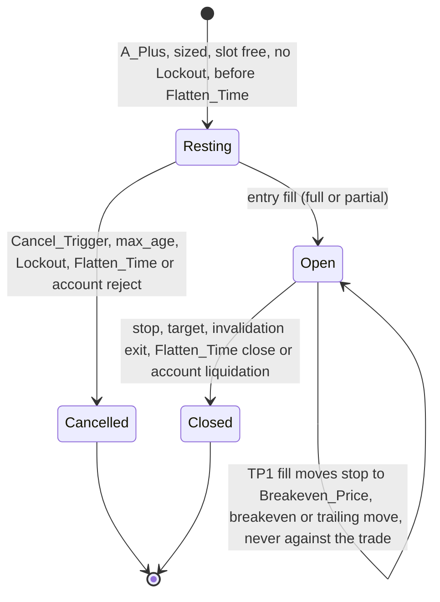

# Design Document: Skylit Futures Strategy Engine

## Overview

The feature replaces LLM interpretation of the Skill_Documents with a deterministic Strategy_Engine. The engine is one pure Python package with one entry point, `Engine.step()`. The Backtester calls it over cached Skylit history. The Live_Runner calls it on live data. Both hand it the same point-in-time `MarketView` interface, so no decision can read data from after its Decision_Time, and a recorded live session replays to the same decisions.

Around the engine sit two pipelines:

- **Offline:** pull → Data_Cache → Backtester → Experiment_Runner (funnel, shadow trades, ablation, frontier, cadence, walk-forward, holdout) → Monte_Carlo_Simulator → Report_Generator → Revised_Drafts.
- **Online:** live feeds → recorder → engine → Paper_Broker (default) or ProjectX → Finding_Card → Notifier, with an optional Narrator that only rewrites card text.

The design takes no position on whether any Skill_Document rule has edge. Every rule is a toggleable Pattern, Gate, Exit_Mode or Kill_Switch, and the Playbook_Baseline encodes the rules as written, including the rules that conflict.

### Key design decisions

| # | Decision | Choice | Rationale |
| --- | --- | --- | --- |
| D1 | Language and runtime | Python 3.14 (3.14.6 installed on the Operator machine), one package `fse` | Requirement intro open question 5. Mature numeric and HTTP libraries; Hypothesis for property tests. |
| D2 | Instants | `int` nanoseconds since the Unix epoch, UTC, everywhere. America/New_York appears only inside `timekit` session rules (`zoneinfo` plus pinned `tzdata`) | No naive datetimes, no DST ambiguity, cheap comparisons (Req 5.8). |
| D3 | Futures prices | Integer ticks (1 tick = 0.25 point). Converted levels are floats until rounded to ticks | Exact band, stop and fill arithmetic (Req 8.5, 13.9). |
| D4 | Money | `decimal.Decimal` for P&L, fees, balances and R | Exact accounting invariant (Req 13.10) and exact R = −1 (Req 13.11). |
| D5 | Data_Cache | Parquet (pyarrow) file per Cache_Window plus a SQLite catalog that holds completion state. Default root `~/.skylit-fse/cache`, outside the repo | Columnar, compressed, float64-exact. Atomic "complete" marking (Req 3.8–3.10, 1.10). |
| D6 | Strategy_Config format | YAML read with a safe loader that rejects duplicate keys, validated by pydantic v2 models in strict mode with unknown keys forbidden | Line numbers on syntax errors, full error lists with key paths (Req 17.3–17.4). |
| D7 | Determinism | Canonical JSON for logs, seeded `numpy.random.Generator(PCG64)`, no clock or RNG reads inside `engine`, parallel runs merged in definition order | Byte-identical reruns (Req 18.5, 21.9). |
| D8 | Availability rule | Each input carries `available_at`. Historical backtest: `available_at = Observation_Time`. Live and replay: `available_at = max(Observation_Time, receipt_time)` | One rule gives no-look-ahead in backtests and live/replay parity (Req 5.3, 23.9). |
| D9 | Live concurrency | `asyncio`. The engine step is synchronous and never awaits the broker, Notifier or Narrator | 1 s budget and independence (Req 23.6, 23.11, 25.13–25.15). |
| D10 | Safety posture | Paper by default, three-condition Combine_Opt_In, fail-closed persistent entry blocks, Risk_Manager checks before the Broker_Adapter | Req 23.1, 24.1–24.27. |
| D11 | Pull priority | Newest sessions first: the last 365 days at full resolution via `/v1/historical/range`, then older sessions sampled via `/v1/historical` | The unlimited key is temporary; recent data is the most valuable and the only data at 1 s resolution. |

### Research findings

These facts shape the design. Sources are the Skylit docs index ([llms.txt](https://www.skylit.ai/docs/llms.txt)) and the ProjectX Gateway docs. Content was rephrased for compliance with licensing restrictions.

- **Limits** ([Rate limits and retries](https://www.skylit.ai/docs/api-reference/rate-limits-and-retries)): the per-key requests-per-minute limit comes from `GET /v1/account` and counts requests to every Skylit host (`api`, `flow-api`, `atlas-api`) together. Pro, Developer, Initiate and Community keys get 600 per minute; invite keys get 120. Historical replays in flight are capped by `limits.historicalInFlight`. Failed requests (any 4xx or 5xx) are refunded. The documented backoff is full jitter, capped at 30 s, 5 attempts. The gateway's own 429 sends no `Retry-After`. Streams count 60 s of silence as a dropped connection.
- **`GET /v1/historical/range`** ([docs](https://www.skylit.ai/docs/api-reference/heatmap/replay-every-snapshot-in-a-window-up-to-15-minutes-5-symbols)): 25 credits per call, window up to 15 minutes, `from` up to 365 days back, up to 5 symbols in one call, frames reference shared axes (`axes[frame.axis].strikes[i]`), resolution 1 s where stored, else 1 min, gzip on request. The documented frame carries `asOf`, `axis`, `spot`, `previousClose` and `values`, with no `nodeType`. The parameter list has no `includeEmpty`.
- **`GET /v1/historical`** ([docs](https://www.skylit.ai/docs/api-reference/heatmap/replay-per-strike-heatmap-at-a-past-instant-one-or-more-symbols)): 5 credits per call, latest snapshot at or before `at`, up to 10 symbols, history from 2023-03-28, per-strike `nodeType` in the example, `404 no_data`, `504 gateway_timeout` refunded, `includeEmpty` supported.
- **Live endpoints:** `GET /v1/heatmap` costs 1 credit and is cached 5 s. `GET /v1/gex/levels` costs 1 credit and is live only. `GET /v1/stream` v2 takes up to 10 symbols and one metric per connection, bills 1 credit per symbol per minute, resumes with `Last-Event-ID`, ends after 1 hour with a `reconnect` event, and pings every 15 s ([stream docs](https://www.skylit.ai/docs/api-reference/heatmap/live-sse-stream-up-to-10-symbols-per-connection)).
- **Atlas `GET /v1/history`** ([docs](https://www.skylit.ai/docs/api-reference/history/ohlcv-price-bars-for-a-symbol-and-resolution)): 1 credit, UDF column arrays, `[from, to)` in Unix seconds, 1-minute tier capped at 90 trading days per request (the cap is readable for free from `GET /v1/config`), `extended=false` by default (RTH only), `200 {"s":"no_data"}` for empty windows. `GET /v1/config` lists `futures` among symbol types. Futures ticker names are not documented; `GET /v1/search` resolves them.
- **`GET /v1/dark-pool/trades`** ([docs](https://www.skylit.ai/docs/api-reference/dark-pool/paginated-off-exchange-trf-prints)): 5 credits, trade-date span at most 31 days, default minimum notional $1,000,000, `limit` up to 5,000, `offset` up to 50,000, a `timestamp` per print, no side.
- **ProjectX Gateway** ([order place](https://gateway.docs.projectx.com/docs/api-reference/order/order-place/), [auth](https://gateway.docs.projectx.com/docs/getting-started/authenticate/authenticate-api-key/), [rate limits](https://gateway.docs.projectx.com/docs/getting-started/rate-limits/)): login with `userName` plus `apiKey` returns a 24-hour session token. `customTag` must be unique across the account. Brackets are expressed in ticks and are accepted only when the account uses Auto OCO Brackets mode; otherwise the order is rejected with `errorCode 2`. `retrieveBars` is limited to 50 requests per 30 s, every other endpoint to 200 per 60 s.

### Open questions: resolution

| # | Question (from requirements, plus new ones) | Status | Design response |
| --- | --- | --- | --- |
| OQ1 | Atlas `/v1/history` coverage of ES/NQ futures | Carried forward, handled | `fse pull` probes each instrument (Req 4.2) with the Atlas ticker from the roll calendar (resolved once via `GET /v1/search`) and `extended=true`. Not served → ProjectX `retrieveBars` for that instrument (Req 4.3). ProjectX depth for expired contracts is also unconfirmed, so the probe covers it and the coverage report records it. |
| OQ2 | Depth of Flowseeker dark-pool prints and intraday VIX | Carried forward, handled | Dark-pool gaps go to the coverage report (Req 4.13) and make `dark_pool_confluence` fail with `data_unavailable` (Req 11.11). VIX daily open and prior close come from Atlas `VIX` bars (assumed served; probed). Fallback: `fse import-vix` loads an Operator CSV into the Data_Cache. |
| OQ3 | `nodeType` in stored history | Partly resolved | Range frames carry no `nodeType` (docs example), so King and Gatekeeper agreement (Req 6.22–6.23) is measured on `/v1/historical` snapshots. Optional `--label-sample-minutes N` on `fse pull` adds one `/v1/historical` call per N minutes on range-fetched sessions so recent sessions can be compared too. Off by default. Whether older dates always carry `nodeType` stays open; the report counts snapshots without labels. |
| OQ4 | Topstep rule values | Carried forward (Operator action) | Defaults live in the Config_Schema and in `docs/account-rules.md` with source and check date (Req 15.19–15.20). |
| OQ5 | Implementation language | Resolved | Python 3.14 (D1). |
| OQ6 | Does `/v1/historical/range` apply the `includeEmpty=false` strike filter? | New, open, low impact | A strike with \|value\| < 50 can never be a Node, because the node threshold is 20% of the King. The only effect is Node_Velocity availability for tiny strikes. Each cached Cache_Window records its `source_endpoint`. |
| OQ7 | ProjectX bracket mode | New, Operator action | Practice and Combine need the account in Auto OCO Brackets mode. A bracket rejection triggers the Req 24.9–24.10 path. The README states this. |
| OQ8 | Does ProjectX order search return `customTag`? | New, open | If not, the client-id lookup (Req 24.14) falls back to the local order journal (`orderId` ↔ client id). If neither confirms, the resubmission is skipped (Req 24.15). |
| OQ9 | Sub-minute bars for the 5 s cadence | New, open | Atlas's smallest bar is 1 minute. Req 18.8 needs stored bars no longer than the shortest cadence, so the default 5/60/300 s comparison needs 5 s bars. `fse pull --bar-interval 5` tries ProjectX second bars (assumed `unit=1`). Without them, Req 18.9 reports the error and the Operator runs 60/300. |
| OQ10 | Atlas bar timestamp convention | New, assumption | UDF `t` is taken as the bar open time. The probe compares overlapping Atlas and ProjectX bars and fails the pull if the two sources disagree by a whole bar. |

## Architecture

### System context



### Layering and dependency rule

Dependencies point inward:

1. **Adapters** (`fse.skylit`, `fse.projectx`, `fse.notify`): network I/O.
2. **Data** (`fse.data`, `fse.calendars`): cache, bars, calendars, coverage.
3. **Point-in-time** (`fse.pit`): `MarketView` and as-of indexes.
4. **Engine** (`fse.engine`): pure decision logic. It may import only `fse.engine.*`, `fse.config.schema`, `fse.timekit`, `fse.pit.protocols`, the standard library and numpy. A unit test parses the AST of every engine module and fails on any other import, and on any use of `time`, `datetime.now`, `random`, `os.environ` or file I/O.
5. **Simulation** (`fse.sim`): Fill_Simulator, Account_Simulator, Paper_Broker.
6. **Orchestration** (`fse.backtest`, `fse.experiments`, `fse.live`).
7. **Analytics and reports** (`fse.analytics`, `fse.reports`, `fse.skilldocs`).

Every write of a log, report, manifest, recording, Finding_Card or error goes through `fse.logio.LogWriter` (Req 1.9).

### Module layout

```text
members/alantiix/skylit-futures-strategy-engine/
  README.md  LICENSE  .env.example  .gitignore  pyproject.toml  requirements.lock
  configs/
    playbook_baseline.yaml          # Playbook_Baseline (Req 17.9)
    experiments/                    # sweep, ablation, cadence and walk-forward definitions
  calendars/
    economic_events.yaml            # CPI, NFP, FOMC, Operator events (Req 4.14)
    exchange_calendar.yaml          # holidays, early closes (Req 4.15)
    roll_calendar.yaml              # contract per session, Atlas ticker, ProjectX id (Req 4.5)
  docs/
    traceability.md                 # rule ↔ config key table and conflict list (Req 17.10–17.11)
    account-rules.md                # Topstep defaults, source, date checked (Req 15.19–15.20)
  prompts/narrator.md               # Narrator instructions (Req 26.13–26.14)
  src/fse/
    cli.py                          # argparse entry point: `fse <command>`
    settings.py                     # env and .env loading, default paths
    timekit.py                      # Instant, NY session rules, Decision_Time grid
    calendars.py                    # calendar file parsing and coverage checks
    logio/   log_writer.py redact.py canonical_json.py
    secrets/ env.py scanner.py
    skylit/  client.py ratelimit.py retry.py fetch_log.py endpoints.py models.py
    projectx/ session.py bars.py broker.py models.py
    data/    cache.py catalog.py planner.py estimate.py puller.py coverage.py
             bar_source.py darkpool.py vix.py path_guard.py
    pit/     protocols.py asof.py market_view.py
    engine/  step.py state.py nodes.py taps.py lifecycle.py regime.py levels.py
             chart.py targets.py planner.py sizing.py risk.py
             setups/ registry.py gatekeeper_fade.py floor_ceiling.py beach_ball.py
                     rug.py whipsaw.py trend.py
             gates/  registry.py catalog.py
    sim/     fills.py account.py paper_broker.py
    config/  schema.py loader.py printer.py warnings.py hashing.py
    backtest/ runner.py manifest.py decision_log.py shadow.py replay.py
    experiments/ runner.py variants.py ablation.py sweep.py cadence.py
                 walkforward.py holdout.py ranking.py
    analytics/ metrics.py funnel.py frontier.py bootstrap.py montecarlo.py
    reports/ markdown.py tables.py
    live/    runner.py map_feed.py bar_feed.py darkpool_feed.py levels_compare.py
             recorder.py guards.py state_store.py order_router.py
    notify/  finding_card.py notifier.py narrator.py
    skilldocs/ check.py fixes.py drafts.py approvals.py
  tests/
    unit/  property/  integration/  perf/
    strategies/                     # Hypothesis generators
    fixtures/                       # synthetic data only, never real keys or real Skylit data
```

Runtime dependencies, pinned exactly in `pyproject.toml` and hashed in `requirements.lock`: `httpx==0.28.1`, `httpx-sse==0.4.3`, `pydantic==2.13.5`, `pyarrow==25.0.1`, `numpy==2.5.3`, `PyYAML==6.0.3`, `python-dotenv==1.2.4`, `tzdata==2026.4`. Development: `pytest==9.1.1`, `hypothesis==6.168.3`, `respx==0.23.1`, `pytest-asyncio==1.4.0`, `ruff==0.16.10`, `mypy==2.4.0`. Versions were current on PyPI when this design was written. The CLI uses `argparse` and SQLite uses the standard library, which keeps the dependency list short for a public repository.

### Time model

- **Instant:** `int` ns UTC. Parsing RFC3339 (`asOf`, dark-pool `timestamp`) and Unix seconds (Atlas `t`) happens only in adapters.
- **Session rules** (`timekit.SessionCalendar`): built from `exchange_calendar.yaml`. For session date `d`: RTH open = `d 09:30 NY`. Close = `d 16:00 NY`, or the early-close time. Trading-day start = `(d − 1 calendar day) 18:00 NY`. Pull_Window = configured start and end (default 09:00–16:00), ending at the early close on early-close dates. Flatten_Time and Flat_Deadline follow Req 12 and Req 15.15. Every local time is turned into an Instant with `datetime(..., tzinfo=ZoneInfo("America/New_York"))`. 18:00, 09:30 and 16:00 never fall inside the 02:00 DST transition hour, so each is unambiguous (Req 5.8).
- **Decision_Time grid** (Backtester): `09:30:00 + k × cadence` for k ≥ 0 while the result is before 16:00:00 (Req 18.1: 390 per session at 60 s). On early-close sessions the Decision_Times after the close see no new bars, and Flatten_Time has already passed, so they log the state and place nothing.
- **Live Decision_Times:** each cadence tick, plus each arrival of a new Map_State or closed bar (Req 23.6). The recorder logs every Decision_Time so replay uses the same instants (Req 23.9).
- **Observation_Time** is computed once at ingest and stored with each record: Snapshot `asOf`; bar `close_ns = open_ns + duration`; dark-pool print `timestamp`; VIX daily open `d 09:31`; VIX prior close = prior session close.
- **`MarketView(t)`**: the only way the engine sees data. Backed by `AsOfIndex` objects (sorted `available_at` arrays plus `bisect_right`). Every accessor returns only records with `available_at ≤ t`. In the Backtester, a view over a session holds arrays truncated at `t`. In live mode, it reads append-only ring buffers.

### Decision loop



The order inside one Decision_Time `t` is fixed:

1. **Bar phase** (in the runner, shared code `fse.sim`): for each base bar that closed in `(t_prev, t]`, in close-time order:
   1. Fill_Simulator matches working orders (market, then stops, then limit entries, then targets) per Req 13.
   2. Account_Simulator checks MLL and DLL on the bar's worst prices (Req 15.8–15.12).
   3. Risk_Manager updates Kill_Switch counters from new fills and checks the internal daily loss stop at each 1-minute close (Req 16.1–16.6).
   4. Order_Planner bar-close stop updates: breakeven trigger, trailing, TP1 → breakeven. Each takes effect from the next bar (Req 12.8, 12.10–12.14).
   5. Tap tracker and Chart_Feature_Builder consume the closed 1-minute bars (and the 5-minute, 1-hour and 4-hour bars aggregated from them).
2. **Map phase:** Map_State, Snapshot_Age, Node labels, lifecycle, Sloppy_Seconds, Regime, Map_Grade, Dormant, converted levels.
3. **Management phase:** Cancel_Triggers on resting entries, invalidation triggers on open positions, resting-entry max age, Flatten_Time.
4. **Setup phase:** Setup_Detector → Candidate_Setups and Detection_Skips → 27 Gates → Grade → Position_Sizer → Order_Planner intents.
5. **Log phase:** one decision-log entry, then shadow-book updates (Backtester only).

Orders issued at `t` can fill only on bars that open at or after `t` (Req 5.5). With 1-minute bars and a 60 s grid, the bar that opens at `t` is processed at `t + 60 s`.

### Engine state, restart and parity

`EngineState` is a frozen dataclass tree. It holds Tap counters, lifecycle maxima, Sloppy_Seconds labels, chart state (swings, BOS_Legs), working orders, open positions, the Risk_Manager state (session counters, Loss_Streak, Lockouts), the client-id sequence and the last Finding_Card triggers. `state.to_canonical_json()` and `EngineState.from_json()` round-trip exactly. The Live_Runner writes the state after every Decision_Time with temp file, fsync and rename. On restart it loads the state, replays recorded inputs after the saved Decision_Time, and continues. A state file that cannot be read sets a persistent block (Req 16.10).

Live-only guards (stale-map block, halt, broker blocks) run outside the engine. They are passed into `step()` as `external_blocks` and recorded as `guard_event` inputs, so replay applies them at the same instants (Req 23.9).

### Live data flow



## Components and Interfaces

Signatures are Python with type hints. `Instant = int` (ns UTC), `Ticks = int`, `Money = Decimal`.

### 1. Secrets, Log_Writer and Secret_Scanner (Req 1)

**Environment loading** (`fse.secrets.env`):

```python
def load_env(project_dir: Path) -> EnvView: ...
# For each variable: a non-blank shell value wins; else the .env value; else blank (Req 1.6).

class EnvView:
    def get(self, name: str) -> str | None: ...   # None when blank
    def secret_values(self) -> list[str]: ...    # non-blank Secret_Variable values
```

Secret_Variables: `SKYLIT_API_KEY`, `PROJECTX_USERNAME`, `PROJECTX_API_KEY`, `NOTIFIER_WEBHOOK_URL`, `NARRATOR_API_KEY`, plus each name listed in `FSE_SECRET_VARS` (comma-separated, set by the Operator). `PRACTICE_ACCOUNT_ID` and `COMBINE_ACCOUNT_ID` are in `.env.example` (Req 1.5) and count as Secret_Variables only when listed in `FSE_SECRET_VARS`.

`.env.example` lists `SKYLIT_API_KEY=`, `PROJECTX_USERNAME=`, `PROJECTX_API_KEY=`, `PRACTICE_ACCOUNT_ID=`, `COMBINE_ACCOUNT_ID=`, `NOTIFIER_WEBHOOK_URL=`, `NARRATOR_API_KEY=` and `FSE_SECRET_VARS=`, each with nothing after `=`.

**Redaction** (`fse.logio.redact.Redactor`): built from `EnvView.secret_values()`. `add(value)` registers each ProjectX session token as it arrives. `redact(text)` replaces every registered value, plus its URL-encoded form, with `[REDACTED]`, longest value first so overlapping values cannot leave fragments. `LogWriter` applies it to every sink: file writes, console, Notifier payloads, recordings, manifests, reports, `logging` records (a `logging.Filter`), and uncaught errors (`sys.excepthook`, `threading.excepthook`, the asyncio loop exception handler). `httpx` and `httpcore` loggers are capped at WARNING so request headers are never logged (Req 1.9).

**Path guard** (`fse.data.path_guard`): resolves the configured cache and output directories. A path inside the repository working tree (`git rev-parse --show-toplevel`) that `git check-ignore -q` does not ignore → error naming the path, exit code 2, no file written (Req 1.11). Defaults live under `~/.skylit-fse/` (`cache/`, `runs/`, `recordings/`, `live-state/`, `logs/`) (Req 1.10).

**`.gitignore`** in the Project folder: `.env`, `cache/`, `runs/`, `recordings/`, `live-state/`, `logs/`. These are the default output directory names, in case the Operator points outputs inside the Project folder (Req 1.12).

**Secret_Scanner** (`fse scan-secrets`, `fse.secrets.scanner`):

```python
def scan(repo_root: Path, env: EnvView) -> ScanResult:
    # 1. values = env.secret_values(); none → error "no secret values configured", exit 5 (Req 1.15)
    # 2. paths = `git ls-files -z --cached` (index, includes newly staged); failure → error, exit 5
    # 3. for each path: read working-tree bytes; match any value's UTF-8 bytes → record the path
    # 4. print matched paths only; exit 0 if none matched, else exit 1 (Req 1.13–1.14, 1.16)
```

Output lines are only file paths or fixed status messages, never values or file content (Req 1.16). Values shorter than 8 characters are still searched; the README warns that short ids match more often.

**README content** (Req 1.2, 1.17, 15.20, 24.28): the identity lines, `What it does`, `Skylit surface` (Access `REST`; Heatseeker, Flowseeker, Atlas), setup steps, one complete command line for `fse pull`, `fse backtest`, `fse report`, `fse paper` and `fse scan-secrets`, a table of every `.env.example` variable (purpose, Secret_Variable or not, which commands and Order_Modes need it), the account-rule verification notice, and the TopstepX API terms notice (device and VPN rules).

**Repository edits outside the Project folder:** one row in the `members/alantiix/README.md` Projects table (Req 1.4). `LICENSE` holds the full text of the license the Operator picks; implementation stops and asks if none is chosen (Req 1.3).

### 2. Skylit_Client (Req 2)

```python
class SkylitClient:
    def __init__(self, env: EnvView, cfg: ClientConfig, fetch_log: FetchLog,
                 clock: Clock, rng: random.Random): ...
    async def get(self, host: Host, path: str, params: Mapping[str, str],
                  *, historical: bool = False) -> Response | Failed: ...
```

- **Key check:** before the first request, a blank `SKYLIT_API_KEY` → error naming the variable, exit 3, no request (Req 1.7).
- **Limits bootstrap:** the first request due triggers `GET /v1/account`, which goes through the same retry policy. Missing or non-positive `requestsPerMinute` or `historicalInFlight` → configured fallbacks 60 and 1 (Req 2.1–2.2).
- **`RateLimiter`:** one instance per client, shared by all hosts, because the limit is per key. It keeps a deque of send instants; `acquire()` waits until fewer than `rpm` sends fall in the trailing 60 s. Retries pass through it too (Req 2.3).
- **`historical_slots`:** an `asyncio.Semaphore(historicalInFlight)` held across `/v1/historical` and `/v1/historical/range` attempts (Req 2.4).
- **Low-water pause:** any response with `X-RateLimit-Remaining ≤ low_water` (default 5) sets `paused_until` = `X-RateLimit-Reset`, or now + 60 s without the header. `acquire()` also waits for `paused_until` (Req 2.5).
- **Retry policy** (`fse.skylit.retry`), per request with attempts n = 1..5:

| Outcome | Action |
| --- | --- |
| 2xx | return |
| 429, n < 5 | wait `Retry-After`; else `X-RateLimit-Reset` + U(0, 1) s; else 60 s + U(0, 1) s; retry (Req 2.6) |
| 500/502/503/504, network error, timeout (default 60 s), n < 5 | wait U(0, min(30, 2^n)) s; retry (Req 2.7) |
| Any of the above at n = 5 | Fetch_Log `failed` with last status or error type; continue (Req 2.8) |
| 401/402/403 | stop the command: error with status and error code, exit 3 (Req 2.10) |
| 400/404/422, other 4xx/5xx | Fetch_Log status, error code, path, params; no retry; continue (Req 2.9) |

- **Fetch_Log** (`fetch_log.jsonl` through LogWriter): one line per attempt with `sent_at`, `host`, `path`, `params`, `attempt`, `status` or `error_type`, `error_code`, `x_credits_remaining` (Req 2.11), `duration_ms`. Query parameters never include the key; the `Authorization` header is never logged.
- **`Clock` and `rng` are injected,** so tests drive time and jitter deterministically.

### 3. Puller and Data_Cache (Req 3)

```python
@dataclass(frozen=True)
class HeatmapView:
    max_strikes: int | Literal["all"] = 92
    max_expirations: int | Literal["all"] = 5
    expirations: tuple[str, ...] | None = None
    include_empty: bool = False
    def view_id(self) -> str: ...      # sha256 of canonical JSON, first 16 hex chars

@dataclass(frozen=True)
class CacheWindowKey:
    symbol: str; metric: Literal["gamma", "vanna"]; view_id: str
    session: date; start_ns: Instant

class DataCache:
    def status(self, key: CacheWindowKey) -> Literal["absent", "incomplete", "complete", "no_data"]: ...
    def write_window(self, key, snapshots: Sequence[Snapshot], source_endpoint: str) -> None: ...
    def read_window(self, key) -> list[Snapshot]: ...
    def mark_incomplete(self, key) -> None: ...
```

**Planning** (`fse.data.planner`):

1. Validate the range before any Replay_Request: start ≤ end, end ≤ today, `GET /v1/symbols` succeeds, and every configured symbol is listed (Req 3.14).
2. Sessions come from `exchange_calendar.yaml`. Each session's Pull_Window is tiled into 15-minute Cache_Windows from the start; the last window may be shorter (Glossary).
3. Skip a symbol's sessions dated before its `history.from` and record them as skipped (Req 3.5).
4. Serve each `complete` or `no_data` window of a completed session from the cache (Req 3.8).
5. For every other window:
   - session < 365 days before the pull date: one `/v1/historical/range` call per (window, metric), carrying up to 5 symbols (Req 3.3);
   - otherwise: `/v1/historical` at the Pull_Window start and each sample-interval multiple inside the window, carrying up to 10 symbols per call (Req 3.4).
6. Order the work newest session first (D11).

**Estimate** (`fse.data.estimate`, printed before the first Replay_Request, Req 3.1): exact request counts from the plan; credits = count × configured credits per endpoint (defaults: range 25, historical 5); disk GB = frames × strikes × 8 bytes × the configured compression ratio (default 0.35, recalibrated from the bytes actually written by earlier pulls). Totals and per symbol and metric. Over the limit (default 20 GB) → interactive confirmation; non-interactive runs abort (Req 3.2).

Rough budget per full session with 5 symbols and both metrics: range path 28 windows × 2 metrics = 56 calls, 1,400 credits; sampled path at 60 s, 420 × 2 = 840 calls, 4,200 credits. At 1 s resolution, raw storage is about 185 MB per session before compression. Storing at a 5 s interval (Req 3.7) cuts that by 5× and still supports a 5 s cadence.

**Window write protocol** (Req 3.9–3.10, 3.15):

1. `catalog.sqlite` row → `incomplete` before the first request for the window.
2. Snapshots after the storage-interval filter → `window.parquet.tmp`, fsync, rename to `window.parquet`.
3. In one SQLite transaction: status `complete` (or `no_data` when every request returned `no_data`), row count, `source_endpoint`, file sha256.
4. Any exception, interrupt or failed request before step 3 leaves `incomplete`. A write error stops the pull with the key in the message.

**Storage-interval filter** (Req 3.7): the interval is a whole number of seconds from 1 to 300 that divides 900; any other value is rejected. Each Cache_Window is filtered on its own, with boundaries at Cache_Window start + k × interval from the window start to the window end, both inclusive. For each boundary keep the window's Snapshot with the latest `asOf ≤` boundary; deduplicate when one Snapshot serves consecutive boundaries.

**Directory layout:** `cache/heatmaps/{symbol}/{metric}/{view_id}/{YYYY-MM-DD}/{HHMM}.parquet`, `cache/bars/{instrument}/{interval}/{YYYY-MM-DD}.parquet`, `cache/vix/…`, `cache/darkpool/{ticker}/{YYYY-MM}.parquet`, `cache/catalog.sqlite`.

**Coverage report** (`coverage_{pull_id}.md` and `.json`, written in a `finally` block so interrupts still produce it, Req 3.11 and 4.2, 4.6, 4.8, 4.11, 4.13): per symbol and metric, sessions requested, sessions with at least one Snapshot, sessions skipped before first history, `meta.resolution` per session, `no_data` gaps with start and end, incomplete windows. Per instrument: served-by-Atlas probe, contract and source per session, missing RTH minute ranges with cause. VIX and dark-pool gaps.

**Offline mode** (`--offline`): the Backtester builds no `SkylitClient` at all, so no key check and no network (Req 1.8, 3.12). Before the first Decision_Time it prints each session with absent or incomplete windows: symbol, metric and count (Req 3.13).

### 4. Bar_Source and auxiliary data (Req 4)

```python
class BarProvider(Protocol):
    async def bars(self, instrument: str, contract: ContractRef, start: Instant,
                   end: Instant, interval_s: int) -> BarBatch: ...

class BarSource:
    def __init__(self, atlas: AtlasBars, projectx: ProjectXBars, roll: RollCalendar,
                 served: dict[str, bool]): ...
```

- **Roll calendar** (`calendars/roll_calendar.yaml`): per instrument, contiguous session ranges, each with `contract` (e.g. `MESZ6`), `atlas_symbol` and `projectx_contract_id`. All bars of a trading day come from that session's contract (Req 4.5).
- **Probe at pull start** (Req 4.2–4.3): for each instrument, request 1-minute bars for the first and last sessions of the range from Atlas (`extended=true`). Both non-empty → Atlas serves the instrument; else the alternate source (default ProjectX) for every session of the pull. The probe result and last error code go to the coverage report.
- **Windows:** Atlas requests are split into contiguous, non-overlapping windows of at most `max_days` trading days (read from free `GET /v1/config`, default 90) (Req 4.4). ProjectX requests stay within its bar limit per call, spaced under 50 requests per 30 s.
- **Normalization** (Req 4.7): every bar becomes `Bar(open_ns, close_ns, o, h, l, c, v)`. Atlas `t` (Unix seconds, taken as open time, OQ10) and ProjectX `t` (ISO 8601 with offset) both become UTC ns. Futures prices are stored both as received (float64) and as ticks (`round_half_up(price × 4)`). A price off the tick grid is logged in coverage.
- **Missing RTH minutes:** recorded with cause, never synthesized (Req 4.8).
- **VIX** (`fse.data.vix`, Req 4.9–4.11): daily open from the 09:30 1-minute VIX bar's open (Observation_Time 09:31), prior close from the prior session's last RTH bar close. Optional intraday 1-minute bars. Missing items go to coverage.
- **Dark pool** (`fse.data.darkpool`, Req 4.12–4.13): fetched only when `dark_pool_confluence` is enabled. Per ticker, contiguous spans of at most 31 days with `limit=5000` and paging by `offset`. A span that would pass offset 50,000 is split in half and retried. Per-session gaps (no prints, or last error code) go to coverage.
- **Calendar files** (`fse.calendars`, Req 4.14–4.16): YAML with `covers: {first: YYYY-MM-DD, last: YYYY-MM-DD}` and an entry list. Validation before the first Decision_Time: file present, parses, every date and time valid, every run session inside `covers`. The error names the file and the first bad entry or uncovered session.

### 5. Point-in-time layer (Req 5)

```python
class MarketView(Protocol):            # fse.pit.protocols
    t: Instant
    def map_state(self) -> MapState: ...                        # latest asOf ≤ t per (symbol, metric)
    def snapshot_at_or_before(self, symbol, metric, at: Instant) -> Snapshot | None: ...
    def snapshots_between(self, symbol, metric, lo: Instant, hi: Instant) -> Iterator[Snapshot]: ...
    def bars(self, instrument, interval_s, since: Instant) -> Sequence[Bar]: ...  # close_ns ≤ t
    def last_bar_closed_at_or_before(self, instrument, at: Instant) -> Bar | None: ...
    def vix(self) -> VixState: ...
    def dark_pool(self, ticker, since: Instant) -> Sequence[DarkPoolPrint]: ...
    def events(self) -> Sequence[EconomicEvent]: ...            # calendar, known in advance
```

- `AsOfIndex[T]` stores records sorted by `(available_at, sequence)`. `upto(t)` returns the prefix with `available_at ≤ t` via `bisect_right` (Req 5.1–5.3). Map_State selects by the `asOf` Skylit returned, never by the requested instant.
- A missing (symbol, metric) appears in Map_State as `Unavailable(symbol, metric)` (Req 5.2).
- **Snapshot_Age** = `t − min(asOf in Map_State)`.
- **Node_Velocity** (`fse.engine.nodes.velocity`): `v0` is the latest Snapshot of the same symbol, metric, view and session with `asOf ≤ t − window`. `100 × (|v1| − |v0|) ÷ |v0|`; unavailable when there is no `v0`, the strike is absent from it, or `v0 = 0` (Req 5.9–5.10). Live `velocityPct` is never read.
- **Futures_Price** = close of the latest 1-minute bar with `close_ns ≤ t`.

### 6. Node_Classifier, Taps and lifecycle (Req 6)

Pure functions over one Snapshot (numpy arrays `strikes`, `values`):

```python
def classify(s: Snapshot, p: NodeParams) -> NodeLabels: ...
@dataclass(frozen=True)
class NodeLabels:
    king: float | None; nodes: tuple[float, ...]; floor: float | None; ceiling: float | None
    gatekeepers: tuple[float, ...]; air_pockets: tuple[tuple[float, float], ...]
    clear_skies: bool; empty_basement: bool; clusters: tuple[Cluster, ...] | None
```

Rules, in order:

1. `a = |values|`. If no strikes or `max(a) == 0` → empty labels (Req 6.4).
2. **King** = argmax of `a`. Ties go to the strike nearest spot, then the lower strike (Req 6.2–6.3).
3. **Nodes** = strikes with `a ≥ node_fraction × a[king]` (Req 6.1).
4. **Floor** / **Ceiling** = largest-`a` Node strictly below / above spot, same tie rule (Req 6.5–6.7).
5. **Gatekeeper:** Node `g` strictly between spot and some same-side Node `n` with `a[n] > a[g]` and `a[g] ≥ gk_fraction × a[n]`. Checked against every larger same-side Node farther out (Req 6.8).
6. **Air_Pocket:** for strike-adjacent Nodes `(n_i, n_{i+1})` with `n_{i+1} − n_i ≥ min_width_pct × spot`, the open interval between them (Req 6.9).
7. **Clear_Skies:** at least one Node, and no Node in `(spot, spot × (1 + lookout))` (Req 6.10).
8. **Empty_Basement:** Floor exists and no other Node in `[floor − lookout × spot, floor)` (Req 6.11).
9. **Clusters** (optional): needs converted levels, so it is computed after Level_Converter. Nodes sorted by level; split wherever the gap exceeds the cluster width (ES 5 pts, NQ 5 × NQ/ES at `t`); rank by summed `a`. Labels do not change (Req 6.12–6.13).

Labels are memoized per `(snapshot identity, params hash)`, so ablations of Gates reuse them.

**Tap tracker** (`fse.engine.taps`, stateful, fed 1-minute RTH bars of the mapped instrument): for each Node in the Map_State at the bar's close, overlap = `bar.low ≤ band.hi and bar.high ≥ band.lo`. A Tap is added when the bar overlaps and either it is the first RTH bar or the previous bar did not overlap that Node's band. Session and weekly counters reset at session start and at the first session of each Monday–Friday week. The Node identity is `(symbol, metric, strike)` (Req 6.14). A Tap ends at the close of its last consecutive overlapping bar.

**Lifecycle** (`fse.engine.lifecycle`, Req 6.15): first match of

1. Decaying: `a_now ≤ (1 − decay_fraction) × max_abs_since_0930`. The running maximum covers every Snapshot in the session, read with `snapshots_between`.
2. Delivered: after the Node's latest Tap that week ended, some 1-minute RTH bar traded inside the band of another Node (same symbol and metric) whose band does not overlap this Node's band.
3. Tested: weekly Tap count ≥ 1.
4. Fresh.

**Sloppy_Seconds** (Req 6.16): for each Tap, `ref` = the strike's value in the latest Snapshot at or before the close of the Tap's first bar. Any Snapshot with `asOf` in `(close, close + window]` where `a ≤ (1 − fraction) × |ref|` sets the label from that `asOf` until session end. Each Decision_Time scans the new Snapshots of tapped strikes only.

**Dormant** (Req 6.17–6.18): needs the Regime, so it is computed after step 7. Not Vanna_Dominant → Nodes with `|strike − spot| > dormant_pct × spot`. Vanna_Dominant → none.

**Agreement metrics** (Req 6.22–6.23): computed by the Report_Generator from Snapshots that carry `nodeType`.

### 7. Regime_Classifier (Req 7)

```python
def regime(ms: MapState, med: TrailingMedians, vix: VixState, p: RegimeParams
           ) -> RegimeResult | MissingInput: ...
def map_grade(gamma: Snapshot, labels: NodeLabels, p: GradeParams) -> MapGrade: ...
```

- `raw_mag(snapshot)` = max `a` over strikes with `|strike − spot| ≤ regime_dist × spot`, else 0.
- **Trailing medians** are precomputed per session: the median of `raw_mag` over all RTH Snapshots of the 20 most recent earlier sessions that have Regime_Symbol Snapshots of that metric. They are stored as a derived Parquet keyed by (view_id, regime params hash). Fewer than 20 sessions or a median of 0 → `MissingInput` for the Regime only (Req 7.12).
- Missing gamma Snapshot → `MissingInput` for Regime and Map_Grade (Req 7.11). Missing vanna → Regime only.
- Check order (Req 7.1–7.7):
  1. Vanna_Dominant if `nVEX > 0 and nVEX ≥ multiple × nGEX`, unless the VIX condition is enabled and fails (VIX unavailable, or VIX < prior close × (1 + pct)), in which case it is withheld (Req 7.3).
  2. Structureless if no gamma strike reaches `min_abs`, a required config value (Req 7.4).
  3. Whipsaw if Floor and Ceiling both exist and differ by at most `pct` of the larger, or two present Trinity symbols have Kings on opposite sides of their spots (Req 7.5).
  4. Negative_Gamma if net GEX within the regime distance < 0.
  5. Positive_Gamma.
- **Map_Grade** (Req 7.8–7.10): A_Plus_Map if Node count < 5, the count of Nodes with `a ≥ major_fraction × a[king]` is 1 or 2, and `max(F, C) > 0 and max ≥ ratio × min` (missing counts as 0). F_Map if Node count ≥ 5, or `max(F, C) == 0`, or `max < ratio × min`. Otherwise Neutral_Map.

### 8. Level_Converter (Req 8)

```python
@dataclass(frozen=True)
class Conversion:
    method: Literal["offset", "ratio"]; factor: float      # offset in points or ratio
    futures_close: float; spot: float; paired_bar_close_ns: Instant
def convert(s: Snapshot, bars: MarketView, p: LevelParams) -> ConvertedMap | MissingPrice: ...
def round_to_tick(x: float) -> Ticks:          # floor(4x + 0.5); ×4 is exact in binary
def band(level: Ticks, half_width_pts: float) -> tuple[float, float]: ...
```

- Pairing: the latest 1-minute bar of the session's recorded contract with `close_ns ≤ asOf` (Req 8.4). Missing, ≤ 0, or older than `max_price_gap_s` (default 120) → `MissingPrice(symbol or contract)`. No earlier factor is reused (Req 8.10).
- SPX uses offset; QQQ uses ratio; SPY, NDX and NDXP use their configured method, default ratio (Req 8.1–8.3).
- ES band half-width `h_es` (default 5 pts). NQ band half-width `h_qqq × (NQ ÷ QQQ spot)` from the QQQ Snapshot of the same metric, unrounded (Req 8.6–8.7).
- The ratio method is monotone for positive ratios and the offset method always is. `round_half_up` is monotone, so `L(a) ≤ L(b)` holds (Req 8.9).
- A Candidate_Setup whose source (symbol, metric) has `MissingPrice` fails `no_conversion_price` (Req 8.11). The Setup_Detector still emits the Setup_Key with a placeholder level of `None`, so the funnel counts it.

### 9. Chart_Feature_Builder (Req 9)

An incremental state machine that consumes closed bars in order. The same code runs in live and backtest.

```python
class ChartState:  # part of EngineState
    def on_bar(self, bar: Bar, timeframe: int) -> ChartState: ...
    def features(self, t: Instant) -> ChartFeatures: ...   # only from bars with close_ns ≤ t
```

- **Windows** (Req 9.2–9.6): prior RTH (bars opening ≥ 09:30 and closing ≤ 16:00 on the latest earlier session with such bars), overnight (prior day 18:00 to 09:30), Asia (prior day 19:00 to 02:00), London (02:00 to 08:00), IB30 (09:30 to 10:00). Each is exposed only from its window end. Empty windows are unavailable, never substituted.
- **Aggregation:** 5-minute, 1-hour and 4-hour bars are built from 1-minute bars with boundaries aligned to 18:00 of the trading day; a period ends at `min(start + width, trading-day end)`, so the last 4-hour bar of a 23-hour or 25-hour DST trading day spans 3 or 1 hours (Req 9.7). A higher-timeframe bar is emitted only when all its constituent minutes have closed or its period has ended.
- **Swings** (Req 9.7–9.8): bar i is a swing high if `high[i] > high[j]` for the N bars on each side. It is confirmed when bar i+N closes. The newest K confirmed swings are kept per instrument and timeframe.
- **BOS** (Req 9.9–9.11): on 1m and 5m with the BOS pivot length. A close above the most recent confirmed, unbroken swing high → bullish BOS, and that swing is marked broken. The BOS_Leg origin is the lowest low (bullish) or highest high (bearish) from the swing bar through the break bar; the terminal is the break bar's high or low.
- **Fib levels** (Req 9.12): exactly `{0, 1, −2, −2.25, −2.5, −3.5, −4, −4.5}`, `price = terminal + r × (origin − terminal)`.
- **Leg pruning** (Req 9.13–9.14): keep at most 2 active legs per (instrument, timeframe, direction), dropping the earliest. Drop a leg on a sweep bar: open strictly inside (0, 1), wick through the 0 or 1 level by ≥ sweep ticks, close strictly inside.
- **Candles** (Req 9.15): red, green or doji.
- **Liquidity sweeps** (Req 9.16–9.17) across all exposed Chart_Levels.

### 10. Setup_Detector (Req 10)

```python
class Detector(Protocol):
    id: str
    def detect(self, ctx: DetectContext, p: DetectorParams) -> list[CandidateSetup | DetectionSkip]: ...

@dataclass(frozen=True)
class DetectContext:     # immutable, one per Decision_Time, shared read-only by all detectors
    t: Instant; map_state: MapState; labels: Mapping[SymMetric, NodeLabels]
    converted: Mapping[SymMetric, ConvertedMap | MissingPrice]; regime: RegimeResult | MissingInput
    grade: MapGrade | MissingInput; chart: ChartFeatures; taps: TapView; futures_price: Mapping[str, Ticks]
```

Detectors share no mutable state and are run in registry order over the same frozen context. The output is the concatenation of each enabled detector's own output, so a detector's output cannot depend on other detectors' flags (Req 10.3–10.4).

**Source Nodes** come only from the ES source symbol (SPX) for ES levels and the NQ source symbol (QQQ) for NQ levels, in the metric each detector sets (default `gamma`) (Req 10.5).

| Detector id | Source Node selection (defaults) | Direction | Extra detection conditions (configurable) |
| --- | --- | --- | --- |
| `gatekeeper_fade` | Gatekeeper with value > 0 (Pika) | short if above spot, long if below | none |
| `floor_ceiling_bounce` | Floor (not Empty_Basement), Ceiling | long at Floor, short at Ceiling | none |
| `floor_ceiling_bounce_empty_basement` | Floor labeled Empty_Basement (Req 10.2) | long | none |
| `beach_ball` | Node with value < 0 (Barney) below spot and `a ≥ major_fraction × a[king]` | long | none |
| `rug` | nearest Pika Node above spot with a Barney Node below it within `stack_pct × spot`, and no Pika Floor | short | — |
| `reverse_rug` | nearest Pika Node below spot with a Barney Node above it within `stack_pct × spot` | long | — |
| `whipsaw_fade` | Floor and Ceiling | long at Floor, short at Ceiling | Regime is Whipsaw |
| `trend_follow` | nearest Node on the side of spot opposite the King | toward the King | `\|king − spot\| ≥ trend_min_pct × spot` and at most `max_intermediate` (default 1) Nodes between spot and King |

Each detector, per selected source Node, at Decision_Time `t`:

1. **Arm** when `|Futures_Price − L| ≤ arming distance`: ES 10 points; NQ $1.00 × (NQ ÷ QQQ) (Req 10.6). The instrument defaults to MES for ES levels and MNQ for NQ levels.
2. **Entry** = `L ± offset_ticks`, capped at the band edge, rounded to a tick toward `L` (Req 10.7).
3. **Stop:** one-Node-beyond → the nearest Node beyond the invalidation level (default `L`) in the stop direction, within the lookout distance; else fixed ticks beyond the band edge (default 8), rounded away from entry (Req 10.8–10.10).
4. **Targets** come from `fse.engine.targets.plan_targets(setup, exit_mode, ctx)`. The Order_Planner and the min_reward_risk Gate use the same function (Req 10.13, 11.5).
5. **Validate:** `stop < entry < tp1` for a long or `tp1 < entry < stop` for a short, and at least one target. On failure → `DetectionSkip(setup_key, t, condition)` (Req 10.14).
6. **Setup_Key** = `(instrument, pattern, source_strike, direction, session, tap_seq)` with `tap_seq = 1 + Taps of the source Node that ended before t` (Req 10.11).
7. **Attach inputs:** every `asOf`, source spot, Futures_Price, Node metric, strike and value, `L`, conversion factor, band half-width, Regime, Map_Grade, stop rule applied, and referenced chart levels (Req 10.12).

### 11. Gate_Evaluator (Req 11)

```python
@dataclass(frozen=True)
class GateResult:
    setup_key: SetupKey; t: Instant; gate_id: str
    result: Literal["pass", "fail", "disabled"]; measured: Measured; threshold: Threshold
class Gate(Protocol):
    id: str
    def measure(self, c: CandidateSetup, ctx: GateContext, p: GateParams) -> tuple[Measured, bool]: ...
def evaluate(c, ctx, cfg) -> tuple[list[GateResult], Grade]: ...
```

All 27 Gates run in the configured order every time, including Gates after a failure. A disabled Gate is still measured and recorded `disabled` (Req 11.2–11.4). `data_unavailable` comes from typed `Unavailable` values: a Gate never catches a broad exception to produce it (Req 11.11).

| # | Gate id | Measured value | Fails when (defaults) | Source rule |
| --- | --- | --- | --- | --- |
| 1 | `stale_map` | Snapshot_Age s | > 90 s (Req 5.7) | Live map hard rule |
| 2 | `map_grade` | Map_Grade | grade in `{F_Map}` or missing | F map hard pass |
| 3 | `midpoint` | entry position x in [Floor level, Ceiling level] | 0.33 < x < 0.67 and the source Node is not King or Gatekeeper | Never trade the midpoint |
| 4 | `deflection_band` | penetration of Futures_Price past `L` on the far side, pts | > band half-width (price already through the zone) | Enter inside the band |
| 5 | `chart_confluence` | distance from `L` to the nearest Chart_Level, pts | > band half-width | Charts first / A+ #1 |
| 6 | `stdev_fib_zone` | distance from entry to the nearest active leg level in zones {−2..−2.5, −3.5..−4.5}, pts | > band half-width | Std-dev fib recipe |
| 7 | `dark_pool_confluence` | distance to the nearest print with notional ≥ $1M in the trailing 5 sessions, scaled with ratio method, pts | > band half-width, or no data | Flowseeker confluence |
| 8 | `trinity_agreement` | count of agreeing symbols | < 2 of 3, Empty_Basement exception (Req 11.9–11.10) | Trinity |
| 9 | `candle_color` | label of the latest closed candle-timeframe bar | long needs red, short needs green; doji fails | Commandment 9 |
| 10 | `tap_count` | Setup_Key tap_seq | > 2 | King reaction 3rd = pass |
| 11 | `third_gatekeeper_test` | weekly Taps + 1 (Gatekeeper_Fade only; other Patterns pass) | ≥ 3 | Fading a 3rd GK test |
| 12 | `weekly_node_tests` | weekly Taps + 1 | > 2 | Same node max two tests/week |
| 13 | `sloppy_seconds` | label | source Node is Sloppy_Seconds | Sloppy Seconds |
| 14 | `air_pocket_fade` | depth of entry inside an Air_Pocket beyond the source band, pts | > 0 (fade Patterns only) | Fading inside an air pocket |
| 15 | `min_reward_risk` | weighted reward ÷ risk (Req 11.5) | < 3.0, or `no_target` | 3:1 minimum |
| 16 | `opposition_inside_target` | nearest opposition level within 3R | exists (Req 11.8) | Opposition inside 3R |
| 17 | `fomo_travel` | max favorable travel since the current Tap began ÷ (tp1 − entry) | > 0.60 | FOMO 60% |
| 18 | `open_shuffle` | minutes since 09:30 | < 15 | First 15–30 min shuffle |
| 19 | `entry_cutoff` | local time | ≥ 15:25 | No 15:25+ entries |
| 20 | `late_session_chase` | local time, direction vs King | in [15:30, 16:00) and Trend_Follow or toward the King | No 3:30–4:00 chase |
| 21 | `news_window` | minutes to the nearest CPI/NFP/FOMC release | ≤ 5 | News window |
| 22 | `vix_gap` | session VIX gap % | ≥ 15% and time < 12:00 | VIX gap until the map settles |
| 23 | `regime_match` | Regime | not in the Pattern's allowed set (table below), or missing | Regime playbook |
| 24 | `dormant_node` | label | source Node is Dormant | Far-OTM dormant |
| 25 | `gatekeepers_on_path` | Gatekeepers strictly between entry and tp1 | ≥ 2 | Multiple GKs kill the target |
| 26 | `node_growth_divergence` | source Node_Velocity % | ≥ +20% for fade Patterns, or unavailable | Floor should shrink after bounce |
| 27 | `kill_switch_lockout` | active Lockouts | any active (Req 16.9) | Bootcamp kill switches |

`air_pocket_fade` can fire only when a positive entry offset or a cluster merge puts the entry off a Node level. With the baseline entry rules it should never fire. The funnel will show this, and the traceability table notes it.

Allowed Regimes per Pattern in the Playbook_Baseline: fades (`gatekeeper_fade`, both `floor_ceiling_bounce` detectors, `beach_ball`) → Positive_Gamma, Whipsaw; `whipsaw_fade` → Whipsaw; `rug` → Positive_Gamma, Negative_Gamma; `reverse_rug` → Positive_Gamma, Negative_Gamma; `trend_follow` → Negative_Gamma, Vanna_Dominant. Structureless allows nothing.

**Grade** (Req 11.12): A_Plus if no enabled Gate fails; Alert_2R if the only failing enabled Gate is `min_reward_risk` with a measured value ≥ 2.0; else Pass.

### 12. Order_Planner and order lifecycle (Req 12)

```python
def plan_targets(c: CandidateSetup, mode: ExitModeCfg, ctx) -> Targets | NoTarget: ...
def manage(state: OrderBook, ctx: ManageContext, cfg) -> tuple[OrderBook, list[OrderIntent], list[Event]]: ...
def place(state: OrderBook, accepted: list[SizedSetup], ctx, cfg) -> tuple[OrderBook, list[OrderIntent], list[Rejection]]: ...
```

**Targets** (Req 12.3–12.9, 12.12): computed from the Map_State at the Candidate_Setup's Decision_Time and rounded to a tick toward entry, at least 1 tick beyond entry.

| Exit_Mode | Target |
| --- | --- |
| Fixed_R | `entry ± r × \|entry − stop\|` |
| Next_Node | nearest other Node beyond entry in the trade direction |
| TP1_Partial_BE | TP1 and TP2 by rule (R or Node); TP1 quantity `max(1, floor(f × qty))`; TP2 the rest; TP2 must be beyond TP1 |
| Opposition_Or_Fixed_R | the nearer of the first opposition Node (≥ 85% of source `a`) and the R target |
| Trailing | none (node-to-node or fixed-ticks stop updates) |

A missing Node target → `no_target_node`; TP2 not beyond TP1 → `tp2_not_beyond_tp1`. Per-Regime settings override the global Exit_Mode and stop rule (Req 12.2).

**Lifecycle state machine** (one entry order per Setup_Key):



- Stop updates go through `tighten_only(old, new, side)`, which returns `max` for a long and `min` for a short (Req 12.14).
- At the first Decision_Time ≥ Flatten_Time: cancel every resting entry, close every position at market, and accept no new entry for the session (Req 12.15–12.17).
- `max_open` counts resting entries plus open positions across instruments, with a TP2 remainder as one position. When full, an accepted setup records `max_open` (Req 12.18).
- **Cancel_Triggers** compare against the values at the Candidate_Setup's Decision_Time: King flip, source Node gone, sign flip, stdev leg dropped, opposition in target window. Firing cancels the entry and records every trigger. A changed Map_State with no trigger leaves the entry at its original prices (Req 12.19–12.20).
- **Invalidation on open positions:** each enabled trigger has an action. When several fire, precedence is exit at market > breakeven > hold. If the action is breakeven and the last close is at or past Breakeven_Price against the trade → market exit (Req 12.21–12.22).
- **Max age:** at the first Decision_Time at or after placement + age → cancel with `max_age` (Req 12.23).
- A Setup_Key is never placed twice. A new Tap gives a new Setup_Key.

### 13. Fill_Simulator (Req 13)

```python
def on_bar(book: SimBook, bar: Bar, cfg: FillCfg) -> tuple[SimBook, list[Fill]]: ...
```

Per bar, for orders with `placed_at ≤ bar.open_ns` (Req 5.5–5.6; a cancel or price change at `t` applies to bars opening ≥ `t`):

1. Market orders: fill at `open ± slippage` against the order (Req 13.4).
2. Stops: touched if `high ≥ buy stop` or `low ≤ sell stop`. Fill at the stop price, or at the open when the bar opens past it, then ± slippage against the order (Req 13.3).
3. Limit entries: fill in full at the limit price when `low ≤ limit − through` for a buy or `high ≥ limit + through` for a sell, including gap opens (Req 13.1). On the fill bar the stop is checked (Req 13.5).
4. Targets: checked from the bar after the entry fill (Req 13.5). If a bar meets both the stop and a target → stop only, all open contracts (Req 13.6).
5. Fees: `contracts × (commission + exchange_fee)` per fill (Req 13.7).

P&L is exact: `Σ_exit (exit − entry)_ticks × side × tick_value × qty − fees` (Req 13.10). R = `|entry_fill − initial_stop|_ticks × tick_value × qty_at_entry`. R_Multiple = P&L ÷ R (Req 13.11). Contract table (Req 13.9): MES $1.25/tick, MNQ $0.50, ES $12.50, NQ $5.00. Bars missing while a trade is open → the next bar is used and the trade is flagged with the missing count (Req 13.12). `through = 0` → every report is labeled "touch fills (optimistic)" (Req 13.2).

### 14. Position_Sizer (Req 14)

A pipeline of pure steps that stops at the first step yielding 0 (Req 14.8):

```python
STEPS = (base_contracts, big_win_reduce, trinity_size_down, vix_gap_halve, micro_cap)
def size(c, ctx, cfg) -> Sized | Rejection: ...
```

- `base_contracts`: fixed count (5 MES, 3 MNQ) or `floor(risk$ ÷ (stop_pts × point_value))` (Req 14.1–14.2).
- `big_win_reduce`: the previous session's filled trades (Shadow_Trades excluded) with net ≥ $1,200 or ΣR ≥ 3 → `min(base, reduced)` (Req 14.5).
- `trinity_size_down`: trinity measured value exactly 2 of 3 → `max(1, floor(q × 0.5))` (Req 14.6).
- `vix_gap_halve`: gap ≥ 15% → `max(1, floor(q / 2))` (Req 14.7).
- `micro_cap`: `floor((limit − used_ME) ÷ ME_per_contract)`, where used_ME counts open positions and resting entries (Req 14.4).
- 0 → `size_zero` naming the step (Req 14.3). A missing input for an enabled rule → `data_unavailable` naming the input (Req 14.9).

### 15. Account_Simulator (Req 15)

```python
class AccountSim:
    def on_bar(self, bars: Mapping[str, Bar], positions) -> list[AccountEvent]: ...
    def on_fill(self, fill: Fill) -> None: ...
    def check_order(self, order: OrderIntent) -> OrderIntent | Rejection: ...
    def end_trading_day(self) -> list[AccountEvent]: ...
```

- **State per Combine_Attempt:** balance, MLL_Floor, day P&L, best day, current target, blocked flag, days elapsed.
- **Sequential attempts:** when an attempt ends (pass or fail), the Backtester starts a new one on the next trading day, so strategy metrics cover every session. Each attempt is listed with its outcome (Req 15.9, 15.17–15.18).
- **Per bar** (worst price per instrument): equity = balance + unrealized at worst. If equity ≤ MLL_Floor → liquidate, post balance = MLL_Floor (or the open-price value if already below), attempt failed. Else if day P&L + unrealized ≤ −DLL → liquidate, day P&L = −DLL (or the open-price value), block until 18:00. MLL wins when both fire (Req 15.8–15.12).
- **End of trading day** (Flat_Deadline): close at the open of the first bar at or after the deadline, cancel working orders, block until 18:00. Then MLL_Floor = `min(start, max(floor, eod − MLL))`, then the consistency target update, then the pass check (Req 15.7, 15.13, 15.16–15.17).
- `check_order` enforces the position cap across all instruments and directions (Req 15.5) and rejects after an attempt has ended or while blocked.
- Disabled rules are skipped, and every result is labeled with the disabled rule ids (Req 15.3).
- Validation of rule values is part of the Config_Schema and runs before any attempt starts (Req 15.4).

### 16. Risk_Manager (Req 16)

```python
@dataclass(frozen=True)
class Lockout:
    rule: str; started_at: Instant; last_session: date
class RiskState:  # in EngineState
    session_entries: int; session_losers: int; loss_streak: int
    session_net: Money; lockouts: tuple[Lockout, ...]
def on_fill(rs: RiskState, f: Fill, trade_closed: Trade | None, cfg, cal) -> RiskState: ...
def on_minute_close(rs, mark: Money, cfg) -> tuple[RiskState, list[OrderIntent]]: ...
```

- `max_trades`: the first fill of an entry that brings the count to the max → Lockout.
- `max_losers`, `consecutive_losers`: on Losing_Trade close. The consecutive Lockout covers the rest of the session plus the next non-holiday weekday session, and resets Loss_Streak.
- `red_day`: on a last exit fill that leaves session net < threshold.
- `daily_profit_cap`: on any exit fill that brings session net ≥ cap.
- Internal loss stop: at a 1-minute close, net + unrealized at worst ≤ −multiple × risk$ → market-close intents, then Lockout.
- While any Lockout is active: entries withheld, resting entries cancelled, exits keep working (Req 16.8).
- `RiskState` depends only on the ordered fills, bars and config, so the Backtester, an uninterrupted live run and a restarted live run produce the same Lockouts (Req 16.7).

### 17. Config_Loader, Config_Printer, Config_Schema (Req 17)

```python
def load(path: Path) -> LoadResult:            # Ok(StrategyConfig, warnings) | Err(list[ConfigError])
def dump(cfg: StrategyConfig) -> str:          # every key, defaults included
def config_hash(cfg: StrategyConfig) -> str:   # sha256 of dump(cfg)
```

1. **Read:** a missing or unreadable file → error with the path (Req 17.3).
2. **Parse** with `UniqueKeySafeLoader` (a `yaml.SafeLoader` subclass whose mapping constructor raises `DuplicateKey(path, line)`). A syntax error → path plus `problem_mark.line + 1`.
3. **Validate** with pydantic v2 models: `ConfigDict(extra="forbid", strict=True, frozen=True)`, `Field(ge=…, le=…)`, `Literal` enums. Every `ValidationError` item becomes `ConfigError(key_path, kind, expected)`, with kind one of unknown key, duplicate id, missing required key, wrong type, out of range. All errors are reported together (Req 17.4).
4. **Cross-field checks:** account ranges (Req 15.4) and fee ranges (Req 13.8) are errors. A Fixed_R or Opposition_Or_Fixed_R R multiple below an enabled min_reward_risk threshold, globally or per Regime, is a warning naming both key paths and values (Req 17.6).
5. **No credential keys:** a schema test walks every field name and rejects names matching `key|token|secret|password|webhook|url|account_id|account_name|username` (Req 17.5). The Narrator `base_url` is the one allow-listed URL field, and it is not a webhook.
6. **Printer:** `yaml.safe_dump(model.model_dump(mode="python"), sort_keys=False)` with floats written by `repr`, which round-trips exactly. `Decimal` money fields are serialized as strings. Order follows the schema declaration order (Req 17.7–17.8).

### 18. Backtester (Req 18)

```python
def run_backtest(cfg: StrategyConfig, sessions: DateRange, cache: DataCache,
                 out_dir: Path, seed: int | None, mode: Literal["historical", "replay"]) -> RunManifest: ...
```

1. Validate the range (Req 18.2) and calendars (Req 4.16). Print offline gaps (Req 3.13).
2. Sessions are processed in date order. A session with no Snapshot for a configured symbol and metric, or no bars for an instrument, is skipped and recorded in the manifest (Req 18.3).
3. Per session: load windows and bars into in-memory `AsOfIndex` objects, run the Decision_Time grid with the loop above, then process bars to the Flat_Deadline for account rules.
4. **Decision log:** one canonical JSON line per Decision_Time (Req 18.6–18.7). Canonical JSON means sorted keys, `separators=(",", ":")`, floats by `repr`, Decimals as strings, Instants as ints plus an ISO NY string. That makes logs byte-identical across reruns (Req 18.5).
5. The Run_Manifest is written in a `finally` block with status `completed` or `aborted` (Req 18.4).
6. **Replay mode** reads a live recording: `available_at` = receipt time and the Decision_Times are the recorded ones (Req 23.9).

**Performance plan** (Req 18.12: 250 sessions at 60 s in ≤ 10 min, about 2.4 s per session):

- Node labels are memoized per Snapshot.
- Trailing regime medians are precomputed once per cache.
- Only the newest Snapshots of tapped strikes are scanned.
- Parquet reads use column projection, one session at a time.

The budget is about 4 ms per Decision_Time on one core. `tests/perf/test_backtest_budget.py` measures it on a synthetic 250-session cache, marked `perf` and run manually.

### 19. Shadow trades, Gate_Funnel, ablation (Req 19)

**Governing evaluation of a Setup_Key:** the Gate results from the latest Decision_Time at or before the start of the key's first Tap at which the key was emitted. If the key was first emitted during that Tap, the first such Decision_Time. A gap-through entry fill with no Tap counts as the first Tap. This is the evaluation that decided whether an order was resting when price arrived (Req 19.2).

**Final status** (exactly one, Req 19.1–19.5):

- `rejected` if the governing evaluation has a failing enabled Gate;
- else `filled` if any part of the entry filled;
- else `cancelled`, with the cause (Cancel_Trigger, Kill_Switch id, `max_open`, `size_zero`, `no_target_node`, Flatten_Time, account rejection);
- `untapped` if there was no Tap before 16:00.

**ShadowBook** (`fse.backtest.shadow`): its own Fill_Simulator instance on the same bar stream. It places one shadow entry per rejected Setup_Key at the governing Decision_Time with that Candidate_Setup's entry, stop and targets. Shadows follow the same Order_Planner lifecycle rules (Cancel_Triggers, invalidation, Flatten_Time, max age) and skip every account, Risk_Manager, `max_open` and sizing rule. Shadow contracts are the base contracts. Shadows never touch the account, Kill_Switches or accepted metrics (Req 19.8–19.9).

**Funnel report** (Req 19.6–19.7, 19.10–19.12, 19.17): per-Gate fail, only-fail and first-fail counts; the co-rejection matrix (symmetric, diagonal = fail count); only-rejected shadow statistics beside accepted statistics; "no measured edge" or "insufficient sample" flags; per-session top-3 failing Gates.

**Ablation** (Req 19.13–19.16): N + 1 configs built with `variants.disable(base, gate_id)`, run in a process pool on the same session list and seed, merged in definition order. A failed config is marked failed and its deltas are reported as not available.

### 20. Metrics and frontier (Req 20)

`fse.analytics.metrics.summarize(trades, sessions, cfg) -> Metrics` computes:

- trade count, trades per day, share of sessions with a trade, longest losing streak (Req 20.1);
- average win and loss in R, expectancy in R and dollars, profit factor (Req 20.2);
- maximum drawdown in dollars and R (Req 20.3);
- win rates (a), (b) and (c) (Req 20.4), and the break-even win rate (Req 20.5);
- MAE and MFE quantiles (Req 20.6);
- percentile bootstrap confidence intervals (Req 20.12).

Undefined values are a `NotApplicable` sentinel and are rendered as "not applicable" (Req 20.16). Low-sample labels apply below 30 trades (Req 20.13).

**Frontier sweep** (Req 20.7–20.11, 20.14):

1. Validate the sweep definition (Req 20.8).
2. Generate configurations: Exit_Mode × R multiple, plus each Exit_Mode without an R parameter, each with `min_rr = min(r, base)`.
3. Run, then build the table.
4. Pareto set on (expectancy R, Primary_Win_Rate, pass probability), excluding any row with a not-applicable value.
5. Reference win-rate list; ranking with the tie rules.

### 21. Monte_Carlo_Simulator (Req 21)

```python
@dataclass(frozen=True)
class SessionOutcome:
    session: date; net: Money; intraday_low: Money; truncated_by_run_account: bool
def estimate(outcomes: Sequence[SessionOutcome], acct: AccountCfg, paths: int,
             max_days: int, seed: int) -> PassEstimate: ...
```

- Sessions are drawn with `rng.integers(0, n, size=(paths, max_days))` from `Generator(PCG64(seed))` (Req 21.1, 21.9). The seed is generated with `secrets.randbits(63)` when absent and recorded in the manifest (Req 21.10).
- Per path and day (Req 21.2–21.5):
  1. `start + low ≤ MLL_Floor` → fail.
  2. Else `low ≤ −DLL` → day P&L = −DLL.
  3. Else day P&L = net.
  4. End of day: MLL_Floor update, consistency target, pass check.
  5. Stop at pass, fail or `max_days`.
- Outputs (Req 21.6–21.8, 21.11–21.12): pass, fail and unresolved counts and shares (summing to the path count), median and nearest-rank P90 days to pass over passing paths, an "insufficient sample" label below 40 sessions, and input validation.
- Sessions in which the run's own Combine_Attempt ended mid-session are flagged `truncated_by_run_account` and counted in the report. This is a known approximation of resampling path-dependent sessions.

### 22. Overfitting controls (Req 22)

- **Holdout_Period** = the newest `ceil(fraction × n_sessions_with_data)` sessions. Every sweep, ablation, cadence comparison and walk-forward test filters it out, even inside an Operator range. Its dates go in every relevant manifest (Req 22.1–22.3).
- **`fse experiment holdout --config X`** (Req 22.4–22.8):
  1. Validate the config.
  2. Read the Holdout_Log (`holdout_log.jsonl`, append-only: open with `O_APPEND`, fsync, never rewritten).
  3. Warn with the count of overlapping entries and record the warning in the manifest.
  4. Run on holdout sessions only.
  5. Append one entry.
- **Walk-forward** (Req 22.9–22.16): window pairs (train 60, test 20, step 20, short final test window dropped), selection by the walk-forward objective (default expectancy) among configs not labeled insufficient sample, first-listed on ties, a "no selection" pair whose test sessions count as zero-trade sessions, and a report of concatenated out-of-sample results beside pooled in-sample results.

### 23. Live_Runner (Req 23)

```python
class LiveRunner:
    async def run(self) -> None:
        # resolve Order_Mode (Req 24.1–24.6); log mode, config hash, code version, credit projection (Req 23.12)
        # start tasks: map_feed, bar_feed, darkpool_feed?, levels_compare, broker_sync?, decision_loop, notifier
```

- **Refresh interval** < 5 s → refuse to start, naming the setting (Req 23.13). Polling uses `GET /v1/heatmap?symbols=SPX,SPY,QQQ,NDX,NDXP&metric=gamma` and the same with `metric=vanna`: two requests per interval (Req 23.2).
- **Stream mode:** two `/v1/stream` v2 connections, one per metric. Reconnect with `Last-Event-ID` after a close or 60 s without an event, at most once per 5 s (Req 23.3–23.4).
- A failed or slow refresh (> 5 s) is logged and the previous Map_State is kept (Req 23.14).
- **Credit projection per session** (Req 23.12), with a 7-hour run window and 5 symbols:
  - polling at 5 s: 5,040 × 2 heatmap calls = 10,080 credits;
  - stream: about 10 × 420 = 4,200 credits plus 10 to open;
  - plus `/v1/gex/levels` at 60 s: 420 credits.
  Stream mode costs about 40% of polling.
- **Bar feed:** ProjectX `retrieveBars` for closed 1-minute bars of each configured instrument. The poll interval is configurable (default 5 s per instrument), well within 50 requests per 30 s.
- **Decision loop:** wakes on a cadence tick or a new input, builds `MarketView(t)` from ring buffers, runs `Engine.step` synchronously, and hands intents to the order router. The step's measured latency is logged; a step over 1 s is logged as a warning (Req 23.6, 23.11).
- **Stale guard:** Snapshot_Age > 30 s → cancel resting entries within 1 s and block entries until fresh. Stops and exits stay (Req 23.7).
- **Recorder:** every input with its receipt time goes to `recordings/{session}.jsonl.gz` through the LogWriter, never with headers (Req 23.8).
- **Levels comparison** (Paper and Practice): `/v1/gex/levels` every 60 s; agreement is logged and never used in a decision (Req 23.10).
- **Paper mode** routes only to the Paper_Broker. The Broker_Adapter is constructed without order methods in this mode (Req 23.15).

### 24. Broker_Adapter and order safety (Req 24)

```python
class BrokerAdapter:                              # fse.projectx.broker
    async def resolve_accounts(self) -> list[AccountRef]: ...
    async def resolve_contract(self, instrument: str) -> ContractRef | ResolveError: ...
    async def place_bracketed(self, o: EntryIntent) -> PlaceResult: ...
    async def modify(self, order_id, **changes) -> Result: ...
    async def cancel(self, order_id) -> Result: ...
    async def broker_state(self) -> dict[str, BrokerState]: ...
    async def find_by_client_id(self, client_id: str) -> Lookup: ...
```

**Order_Mode resolution at start** (frozen for the run, Req 24.1–24.6):

```text
cfg.order_mode == combine:
    COMBINE_ACCOUNT_ID set and equal to a resolved account id and --live-orders → Combine
    else → Paper, first card lists every failed condition
cfg.order_mode == practice:
    PRACTICE_ACCOUNT_ID set, resolved, and different from COMBINE_ACCOUNT_ID → Practice
    else → Paper, first card names the failure
else → Paper
```

- Credentials and account ids come only from `EnvView`. The CLI has no argument for them (Req 24.7). The ProjectX session token is registered with the Redactor.
- **Bracket entry** (Req 24.8): `Order/place` with `type=1` (limit), `stopLossBracket {ticks: |entry − stop|, type: 4}`, `takeProfitBracket {ticks: |tp1 − entry|, type: 1}`, size = entry quantity, `customTag` = client id. After a fill at a better price, the Live_Runner modifies the bracket legs so their prices equal the planned stop and TP1. For TP1_Partial_BE, the target leg is resized to the TP1 quantity and a TP2 limit is added. This assumes ProjectX allows modifying bracket legs, which must be verified in Practice before Combine use.
- **Stop confirmation** (Req 24.9–24.10): after each fill, BrokerSync must see a working stop covering the full open quantity within 5 s. Otherwise, or on a bracket rejection: market-close the instrument, set a persistent block, send a card.
- **Contract check** (Req 24.11–24.12): at start and at each session start, resolve and log the front-month id. A mismatch with `roll_calendar.yaml` or a resolution failure blocks that instrument for the session.
- **Client ids** (Req 24.13–24.15): `fse-{run_uuid8}-{seq}`, with `seq` persisted in `live-state`, plus an append-only journal of every sent id that is checked before each send. A resubmission first calls `find_by_client_id`. A lookup failure or timeout skips that cycle.
- **Reconciliation** (Req 24.16–24.18): at start and every Decision_Time, compare per instrument the side, quantity and each working order (client id, side, quantity, price). A difference, or a foreign working order on a configured instrument → persistent block plus a card listing each difference. Ignored instruments (MGC, SIL) are listed and never touched (Req 24.19–24.20).
- **Outage** (Req 24.21–24.22): no successful response for 30 s → block entries without touching broker-side brackets. On recovery, reconcile and lift the block only when clean.
- **Risk pre-check** (Req 24.23–24.25): the order router calls `RiskManager.precheck(intent)` for opening or increasing orders (position cap, internal loss stop). Reducing orders pass through.
- **Halt** (Req 24.26–24.27): the halt file is checked every Decision_Time. `fse halt` and `fse clear` write `live-state/blocks.json` atomically. Kinds: `halt_command`, `bracket_failure`, `reconciliation`, `restore_failed`. An unreadable blocks file counts as blocked.

### 25. Finding_Card, Notifier, Narrator (Req 25)

```python
def build_card(t, ms, labels, regime, grade, setups, grades, gates, book, prev_sent) -> FindingCard: ...
def should_send(card, prev_sent, now, cfg) -> bool:
    # interval elapsed (default 5 min) OR grade change OR order event OR King flip; one card per t
```

- **Card fields** (Req 25.1–25.4): map fields, up to 5 setups ordered A_Plus, Alert_2R, Pass with up to 3 Rejection_Reasons, the count not listed, orders, positions, next watch levels. Missing data is shown as `unavailable` or `none`, never left out.
- **Premarket card** at 09:00 (Req 25.7). One 2R alert per Setup_Key the first time it is graded Alert_2R (Req 25.8). No order is ever placed for Alert_2R (Req 25.9).
- **Notifier** sinks: console, file, webhook (`NOTIFIER_WEBHOOK_URL`). Delivery runs in a separate task with a timeout. A failure is logged and changes no order logic (Req 25.14).
- **Narrator** (optional, default off): receives `card.to_narrator_fields()`, which is built from an allow-list of fields with no account ids, then passed through the Redactor. It runs in a separate task with a timeout (default 10 s) and a length cap (1,500 characters). On success the message is prose plus the unchanged card; on any failure, the card plus "narration unavailable" (Req 25.10–25.12).
- **Independence:** order intents are computed and dispatched before card building starts, and nothing in the order path reads Narrator or Notifier state (Req 25.13, 25.15).

### 26. Skill documents and Revised_Drafts (Req 26)

- **`fse skilldocs check`** verifies, for each Skill_Document and Revised_Draft: exactly one front-matter block on line 1, YAML mapping parse, non-empty `name` and `description`, UTF-8 without U+FFFD (Req 26.1–26.3, 26.7), and no Secret_Scanner value (Req 26.17).
- **One-time fixes** (`fse.skilldocs.fixes`, applied once and committed):
  - `current_working_SKILL_100226.md`: replace the two stacked blocks with one block holding `name` and `description` (the union of keys), taking the second block's values because they are the fuller wording (Req 26.4).
  - `SKILL.md`: line 107 `Fresh ? tested ? delivered ? decaying` → `→`; line 144 `?3:1` → `≥3:1`; line 154, each `?` between chain steps → `→` (Req 26.5–26.6).
  - The fixer rewrites only those spans and asserts that the rest of each file is byte-identical (Req 26.8).
- **`fse drafts build --chosen X`** runs after the holdout evaluation (Req 26.9):
  1. Load the Playbook_Baseline and the chosen config.
  2. Label every Pattern, Gate, Exit_Mode and Kill_Switch Kept, Changed or Removed (Req 26.10).
  3. Build one comparison config per rule (disable for Kept, baseline setting for Changed or Removed) and run it on the pre-holdout sessions (Req 26.11).
  4. Write `skill-fine-tune/revised_SKILL_{date}.md` and `revised_TASK_{date}.md` from templates. Each figure carries trade count, session count, labeled date range, config hash and, for pass probability, path count (Req 26.15). Rows from the traceability table marked "not codified" become Unmeasured with the reason (Req 26.12).
- **Template lint:** the templates contain the Narrator restatement rule and the engine-decides rule (Req 26.13–26.14). `fse skilldocs check` also fails a draft that contains the words "target", "expect" or "will" next to a performance figure, or an imperative trade instruction aimed at the Narrator (Req 26.14, 26.16).
- **Promotion** (Req 26.18): `skill-fine-tune/approvals.yaml` records the Operator's approval as a sha256 of the approved draft. `fse drafts promote` copies draft content into `SKILL.md` only when the current draft hash matches a recorded approval. No other code path writes `SKILL.md`.

### Requirements coverage map

| Requirement | Components |
| --- | --- |
| 1 | secrets, logio, path_guard, README, scanner |
| 2 | skylit.client, ratelimit, retry, fetch_log |
| 3 | data.planner, estimate, puller, cache, catalog, coverage |
| 4 | data.bar_source, vix, darkpool, calendars |
| 5 | pit, engine.nodes.velocity, sim.fills timing |
| 6 | engine.nodes, taps, lifecycle, reports (agreement) |
| 7 | engine.regime |
| 8 | engine.levels |
| 9 | engine.chart |
| 10 | engine.setups, engine.targets |
| 11 | engine.gates |
| 12 | engine.planner, engine.targets |
| 13 | sim.fills |
| 14 | engine.sizing |
| 15 | sim.account, docs/account-rules.md |
| 16 | engine.risk, live.state_store |
| 17 | config, configs/playbook_baseline.yaml, docs/traceability.md |
| 18 | backtest |
| 19 | backtest.shadow, analytics.funnel, experiments.ablation |
| 20 | analytics.metrics, frontier, bootstrap, experiments.sweep |
| 21 | analytics.montecarlo |
| 22 | experiments.holdout, walkforward |
| 23 | live |
| 24 | projectx.broker, live.order_router, live.guards |
| 25 | notify |
| 26 | skilldocs |

## Data Models

### Core value types (`fse.engine.types`, frozen dataclasses with `slots=True`)

```python
@dataclass(frozen=True, slots=True)
class Snapshot:
    symbol: str; metric: Literal["gamma", "vanna"]; view_id: str
    as_of_ns: Instant; as_of_raw: str            # raw string kept for exact round-trip (Req 3.10)
    spot: float; previous_close: float | None
    strikes: tuple[float, ...]; values: tuple[float, ...]   # float64, as returned
    node_types: tuple[str | None, ...] | None    # None for range frames
    expirations: tuple[str, ...]; resolution: Literal["1s", "1m"]
    source_endpoint: Literal["range", "historical", "heatmap", "stream"]
    extra_json: str                              # any unrecognized response fields, canonical JSON

@dataclass(frozen=True, slots=True)
class Bar:
    instrument: str; contract: str; interval_s: int
    open_ns: Instant; close_ns: Instant          # close = open + interval (Req 4.7)
    o: float; h: float; l: float; c: float; v: float
    o_t: Ticks; h_t: Ticks; l_t: Ticks; c_t: Ticks   # futures only
    source: Literal["atlas", "projectx"]

@dataclass(frozen=True, slots=True)
class DarkPoolPrint:
    ticker: str; ts_ns: Instant; price: float; size: int; notional: float; venue: str

@dataclass(frozen=True, slots=True)
class VixState:
    daily_open: float | Unavailable; prior_close: float | Unavailable; last_1m_close: float | Unavailable

@dataclass(frozen=True, slots=True)
class SetupKey:
    instrument: str; pattern: str; source_strike: float
    direction: Literal["long", "short"]; session: date; tap_seq: int

@dataclass(frozen=True, slots=True)
class CandidateSetup:
    key: SetupKey; detector_id: str; t: Instant
    entry: Ticks; stop: Ticks; targets: tuple[Ticks, ...]; exit_mode: str
    source: SourceNodeRef                        # symbol, metric, strike, value, level, band
    inputs: SetupInputs                          # every Req 10.12 field

@dataclass(frozen=True, slots=True)
class DetectionSkip:
    key: SetupKey; t: Instant; condition: Literal["price_order", "no_target"]

@dataclass(frozen=True, slots=True)
class Order:
    client_id: str; setup_key: SetupKey | None; instrument: str
    side: Literal["buy", "sell"]; kind: Literal["limit", "stop", "market"]
    qty: int; price: Ticks | None; placed_at: Instant; role: Literal["entry", "stop", "tp1", "tp2", "exit"]

@dataclass(frozen=True, slots=True)
class Fill:
    client_id: str; bar_open_ns: Instant; price: Ticks; qty: int; fees: Money

@dataclass(frozen=True, slots=True)
class Trade:
    setup_key: SetupKey; entry_fill: Fill; initial_stop: Ticks; qty_at_entry: int
    exits: tuple[Fill, ...]; net: Money; r: Money; r_multiple: Decimal
    reached_tp1: bool; mae_r: Decimal; mfe_r: Decimal; missing_bars: int; shadow: bool
```

`Unavailable(reason: str)`, `MissingInput(names)`, `MissingPrice(symbol_or_contract)`, `NotApplicable` and `NoTarget` are distinct sentinel types. They are never `None`, so code cannot confuse "missing" with "zero".

### Storage schemas

| Store | Format | Columns or fields |
| --- | --- | --- |
| Heatmap window | Parquet, zstd | `as_of_ns int64`, `as_of_raw string`, `spot float64`, `previous_close float64?`, `axis_id int32`, `values list<float64>`, `node_types list<string?>?`, `resolution string`, `extra_json string`; axis table: `axis_id`, `strikes list<float64>`, `expirations list<string>`; file metadata: symbol, metric, view JSON, session, window start, source endpoint |
| Catalog | SQLite | `windows(symbol, metric, view_id, session, start_ns, status, rows, source_endpoint, sha256, updated_at, PRIMARY KEY(symbol, metric, view_id, session, start_ns))`; `bars_coverage(...)`; `pulls(pull_id, started_at, args_json)` |
| Bars | Parquet | the `Bar` fields per instrument, interval and session |
| Derived regime medians | Parquet | `session`, `metric`, `view_id`, `params_hash`, `median_raw_mag` |
| Fetch_Log | JSONL | see component 2 |
| Decision log | canonical JSONL | see below |
| Trade list | CSV and JSON | `Trade` fields plus MAE and MFE (Req 20.6) |
| Recording | JSONL.gz | `{kind, received_ns, payload}` with `kind` ∈ snapshot, bar, broker_event, dark_pool, vix, guard_event, operator_event, decision_time |
| Engine state | canonical JSON | `EngineState.to_canonical_json()` |
| Blocks | JSON | `[{kind, instrument?, created_at, detail}]` |
| Holdout_Log | JSONL, append-only | config hash, evaluated_at, holdout first and last, trades, expectancy, win rate, pass probability |

### Decision-log entry (Req 18.7)

```json
{"session":"2026-03-05","t":1772721000000000000,"t_ny":"2026-03-05T09:30:00-05:00",
 "map":{"SPX/gamma":{"asOf":"…","king":5800.0,"floor":5780.0,"ceiling":5825.0},
        "NDXP/vanna":{"missing":true}},
 "futures":{"MES":23201,"MNQ":84012},
 "regime":"Positive_Gamma","map_grade":"Neutral_Map",
 "setups":[{"key":{…},"gates":[{"id":"stale_map","result":"pass","measured":3.0,"threshold":90}],
            "rejections":[…],"grade":"Pass"}],
 "skips":[…],"orders":[…],"fills":[…]}
```

### Run_Manifest (Req 18.4, 20.12, 21.10, 22.3)

`{run_id, kind, config_hash, config_path, code_version (git describe --always --dirty), data_range, sessions_evaluated, sessions_skipped:[{date, missing}], seed, holdout:{first,last}, outputs:[paths], status, warnings, started_at, ended_at}`.

### Strategy_Config shape (abridged YAML)

The Config_Schema defines every key with type, range and default. The layout follows the requirements:

```yaml
schema_version: 1
config_id: playbook_baseline
order_mode: paper                    # paper | practice | combine (Req 17.2)
time: {decision_cadence_s: 60, timezone: America/New_York}
data:
  symbols: [SPX, SPY, QQQ, NDX, NDXP]
  heatmap_view: {max_strikes: 92, max_expirations: 5, include_empty: false}
  regime_symbol: SPX
  es_source_symbol: SPX
  nq_source_symbol: QQQ
  nq_sources: [QQQ, NDX, NDXP]
  instruments: {es_levels: MES, nq_levels: MNQ}
  velocity_window_s: 60
nodes: {node_fraction: 0.20, gatekeeper_fraction: 0.30, air_pocket_min_width_pct: 0.5,
        lookout_pct: 1.0, decay_fraction: 0.20, dormant_distance_pct: 3.5,
        sloppy_seconds: {window_min: 15, fraction: 0.10},
        clustering: {enabled: false, es_width_pts: 5.0}}
regime: {regime_distance_pct: 1.0, vanna_multiple: 2.0, min_abs_value: <required>,
         whipsaw_pct: 15.0, vix_condition: {enabled: true, pct: 5.0},
         grade: {major_fraction: 0.50, floor_ceiling_ratio: 1.5}}
levels: {methods: {SPY: ratio, NDX: ratio, NDXP: ratio}, es_half_width_pts: 5.0,
         qqq_half_width_usd: 0.50, max_price_gap_s: 120}
chart: {pivot_len: {"60": 3, "240": 3}, swings_kept: 5, bos_pivot_len: {"1": 3, "5": 3},
        sweep_ticks: 2, candle_timeframe_s: 60, sweep_timeframe_s: 60}
patterns:
  gatekeeper_fade: {enabled: true, metric: gamma, entry_offset_ticks: 0,
                    stop_rule: one_node_beyond, fixed_stop_ticks: 8,
                    arming: {es_pts: 10.0, nq_qqq_usd: 1.00}}
  # floor_ceiling_bounce, floor_ceiling_bounce_empty_basement, beach_ball, rug,
  # reverse_rug, whipsaw_fade, trend_follow: same shape plus pattern-specific keys
gates:
  order: [stale_map, map_grade, midpoint, …, kill_switch_lockout]   # Req 11.1 order
  stale_map: {enabled: true, max_snapshot_age_s: 90}
  min_reward_risk: {enabled: true, min: 3.0, alert_min: 2.0}
  opposition_inside_target: {enabled: true, fraction: 0.85, window_r: 3.0}
  trinity_agreement: {enabled: true, min_agree: 2, empty_basement_exception: true}
  # … one entry per Gate id
exits:
  global: {mode: opposition_or_fixed_r, stop_rule: one_node_beyond}
  per_regime: {Positive_Gamma: {mode: next_node, stop_rule: one_node_beyond}}
  modes:
    fixed_r: {enabled: true, r_multiple: 3.0}
    next_node: {enabled: true}
    tp1_partial_be: {enabled: false, tp1: {rule: r, r_multiple: 1.5}, tp2: {rule: node},
                     tp1_fraction: 0.5}
    opposition_or_fixed_r: {enabled: true, r_multiple: 3.0, fraction: 0.85}
    trailing: {enabled: false, mode: node_to_node, ticks: 40}
  breakeven: {enabled: true, trigger_r: 1.0, offset_ticks: 1}
orders:
  flatten_time: "15:55"
  early_close_flatten_lead_min: 30
  max_open: 1
  max_age_min: null
  cancel_triggers: {king_flip: true, source_node_gone: true, sign_flip: true,
                    stdev_leg_dropped: true, opposition_in_target: true}
  invalidation: {king_flip: exit_market, source_node_gone: exit_market,
                 sign_flip: exit_market, stdev_leg_dropped: hold, opposition_in_target: hold}
fills: {trade_through_ticks: 1, slippage_ticks: 1,
        costs: {MES: {commission: <required>, exchange_fee: <required>},
                MNQ: {commission: <required>, exchange_fee: <required>}}}   # Req 13.8: no default
sizing: {mode: fixed_contracts, fixed: {MES: 5, MNQ: 3}, risk_usd: "375",
         big_win: {usd: "1200", r: 3, reduced: {MES: 3, MNQ: 2}},
         trinity_size_down: {enabled: true, fraction: 0.5},
         vix_gap: {enabled: true, pct: 15.0}, micro_equivalent_limit: 50}
kill_switches:
  max_trades: {enabled: true, max: 3}
  max_losers: {enabled: true, limit: 2}
  consecutive_losers: {enabled: true, limit: 3}
  red_day: {enabled: true, threshold_usd: "0"}
  daily_profit_cap: {enabled: true, cap_usd: "1200"}
  internal_daily_loss_stop: {enabled: false, multiple: 2.0}
  losing_trade_tolerance_usd: "0"
account:
  starting_balance: {value: "50000.00"}
  profit_target: {enabled: true, value: "3000.00"}
  maximum_loss_limit: {enabled: true, value: "2000.00"}
  daily_loss_limit: {enabled: true, value: "1000.00"}
  consistency_target: {enabled: true, pct: 55.0}
  position_cap: {enabled: true, micro_equivalents: 50}
  flat_deadline: "16:10"
  early_close_offset_min: 15
live: {refresh_interval_s: 5, mode: polling, live_max_snapshot_age_s: 30,
       levels_compare_interval_s: 60, run_window: {start: "09:00", end: "16:00"},
       stop_confirm_s: 5, lookup_timeout_s: 5, outage_s: 30, ignored_instruments: [MGC, SIL],
       expected_contracts: {MES: CON.F.US.MES.Z26, MNQ: CON.F.US.MNQ.Z26}}
notify: {sinks: [console, file], interval_min: 5, premarket: "09:00", alerts_2r: true,
         narrator: {enabled: false, base_url: null, model: null, timeout_s: 10, max_chars: 1500}}
reporting: {primary_win_rate: a, scratch_tolerance_r: 0.1, min_sample_trades: 30,
            bootstrap_resamples: 5000, reference_win_rate: 80.0, shadow_min_sample: 30}
experiments: {holdout_fraction: 0.20, ranking_objective: combine_pass_probability,
              walkforward: {train: 60, test: 20, objective: expectancy, min_trades: 30},
              montecarlo: {paths: 10000, max_days: 60, min_sessions: 40}}
```

Two values in this sketch are not settled by the Skill_Documents:

- `regime.min_abs_value` has no default (Req 7.4). The Playbook_Baseline sets it from a percentile of the cached King values, recorded with its derivation in `docs/traceability.md`.
- Commission and exchange fee per instrument are required with no default (Req 13.8). The Operator enters the current Topstep values in the Playbook_Baseline before the first backtest.

### Playbook_Baseline choices that codify the Skill_Documents

| Rule as written | Codified as |
| --- | --- |
| "+GEX: fade, wider stop, tighter target (next node)" | `exits.per_regime.Positive_Gamma.mode: next_node` |
| "Flatten at 3R or the next opposition node, whichever comes first" | `exits.global.mode: opposition_or_fixed_r`, `r_multiple: 3.0` |
| "50K house minimum 3:1 or pass" / 2:1 alerts | `gates.min_reward_risk.min: 3.0`, `alert_min: 2.0` |
| "Opposition inside 3R → pass" | `gates.opposition_inside_target: {fraction: 0.85, window_r: 3.0}` |
| "BE once working ~TP1 or clean hold" | `exits.breakeven: {trigger_r: 1.0}`, marked approximate in the traceability table |
| "Only one armed A+ limit at a time" | `orders.max_open: 1` |
| Kill switches, size, caps, flatten 15:55 | `kill_switches.*`, `sizing.*`, `orders.flatten_time` |
| Cancel resting limit on King flip, leg invalidation, opposition in 3R | `orders.cancel_triggers.*` |
| Backtest refresh invalidation "treat it as scratched" | `orders.invalidation.{king_flip, source_node_gone, sign_flip}: exit_market` |
| Dark-pool prints and std-dev fib zones listed as "confluence layers", not hard passes | `gates.dark_pool_confluence.enabled: false`, `gates.stdev_fib_zone.enabled: false`. Both are still measured and recorded `disabled`, so the funnel and ablation can test them |
| Every other hard pass, A+ condition and commandment the Gates cover | the remaining 25 Gates `enabled: true` |
| "Unplanned average-down is a hard pass" | not codified: the Order_Planner never adds to a position, so the rule cannot be broken |

`docs/traceability.md` lists the conflicts Req 17.11 requires, with key paths and values:

- `exits.per_regime.Positive_Gamma.mode = next_node` against `gates.min_reward_risk.min = 3.0`: a next-node target closer than 3R fails the Gate.
- `exits.per_regime.Positive_Gamma.mode = next_node` against `gates.opposition_inside_target.window_r = 3.0`: when the next Node has at least 85% of the source Node's value, it is both the target and an opposition Node inside 3R.

## Correctness Properties

*A property is a characteristic or behavior that should hold true across all valid executions of a system-essentially, a formal statement about what the system should do. Properties serve as the bridge between human-readable specifications and machine-verifiable correctness guarantees.*

This feature suits property-based testing: most of it is pure logic (classification, conversion, fills, accounting, metrics, config parsing) over large input spaces. Criteria about static files, live wiring, latency and external services are covered by smoke, example and integration tests in the Testing Strategy. Several criteria were merged during reflection where one property implies another, for example the 13 Node rules into one reference-model property plus the three invariants the requirements name.

**Secrets and logging**

### Property 1: Environment precedence

*For any* pair of shell and `.env` values for a variable (unset, empty, whitespace-only or text), the resolved value is the shell value when it is non-blank, else the `.env` value when non-blank, else blank. When `SKYLIT_API_KEY` resolves blank and a request is due, the Skylit_Client sends zero requests and exits non-zero with a message that names the variable.

**Validates: Requirements 1.6, 1.7**

### Property 2: Redaction completeness

*For any* set of non-blank secret values (overlapping, prefix-sharing and URL-unsafe values included), any registered session tokens, and any text that embeds them, every output produced through the Log_Writer (log lines, reports, manifests, recordings, Finding_Cards, Narrator input, error and uncaught-error output) contains none of those values or their URL-encoded forms, and contains `[REDACTED]` in place of each occurrence.

**Validates: Requirements 1.9, 23.8, 25.10**

### Property 3: Cache path guard

*For any* configured Data_Cache or output path relative to a temporary git repository, the command writes files only if the resolved path is outside the working tree or ignored by git; otherwise it writes nothing, names the path and exits non-zero.

**Validates: Requirements 1.10, 1.11**

### Property 4: Secret_Scanner reports exactly the matching files

*For any* repository whose index holds generated files, some containing one or more configured secret values, the Secret_Scanner prints exactly the set of paths whose working-tree content contains a value, exits 0 if and only if that set is empty, and prints no line other than a matching path or a status message, with no secret value and no file content.

**Validates: Requirements 1.13, 1.14, 1.16**

**Skylit_Client**

### Property 5: Pacing invariants

*For any* schedule of requests and any sequence of simulated responses and latencies, in any rolling 60-second window the client sends at most `requestsPerMinute` requests (retries included), never has more than `historicalInFlight` historical replay requests awaiting a response, and sends nothing between a response at or below the low-water mark and that response's reset time (or 60 s without a reset header).

**Validates: Requirements 2.3, 2.4, 2.5**

### Property 6: Retry policy

*For any* sequence of attempt outcomes (statuses 200–599, network errors, timeouts, with or without `Retry-After` and `X-RateLimit-Reset`) and any `/v1/account` payload, the client makes at most 5 attempts per request, retries only 429, 500, 502, 503, 504, network errors and timeouts, waits exactly as Requirement 2 specifies for each case (header-driven waits for 429; a uniform wait in [0, min(30, 2^n)] s otherwise), records a terminal failure in the Fetch_Log with the last status or error type, and uses the configured fallback for each limit it could not read as a positive integer.

**Validates: Requirements 2.2, 2.6, 2.7, 2.8, 2.9**

**History pull and Data_Cache**

### Property 7: Pull plan correctness

*For any* date range, symbol set, per-symbol first history date, pull date and cache state, the plan holds: every request covers at most one Cache_Window; sessions under 365 days old use `/v1/historical/range` and older ones use `/v1/historical` at exactly the sample-interval instants; no request targets a session before the symbol's first history date; no request targets a complete or `no_data` window of a completed session; and the printed request-count estimate equals the number of planned requests.

**Validates: Requirements 3.1, 3.3, 3.4, 3.5, 3.8**

### Property 8: Interrupted windows stay incomplete

*For any* pull interrupted at any point (Operator interrupt, crash, failed request, write error), every Cache_Window without all its Snapshots durably written is marked incomplete, and the next pull requests exactly the incomplete and absent windows again.

**Validates: Requirements 3.9**

### Property 9: Cache round-trip

*For any* Snapshot (any finite float64 strike values and spot, with or without `nodeType`, any `asOf` string, any extra fields), writing it to the Data_Cache and reading it back yields a Snapshot equal in every field.

**Validates: Requirements 3.10**

### Property 10: Storage-interval filter

*For any* sequence of Snapshot `asOf` values in a Cache_Window and any storage interval from 1 to 300 s that divides 900 s, the stored set for that Cache_Window equals the set of its Snapshots that are the latest at or before at least one boundary of that Cache_Window (Cache_Window start + k × interval, from the Cache_Window start to the Cache_Window end, both inclusive).

**Validates: Requirements 3.7**

### Property 11: Request window partition

*For any* inclusive date range and maximum span (Atlas `max_days` trading days or the 31-day dark-pool cap), the generated windows are contiguous, non-overlapping, each within the maximum, and their union equals the requested range.

**Validates: Requirements 4.4, 4.12**

### Property 12: Bar normalization

*For any* bars from Atlas (Unix seconds) or ProjectX (ISO 8601 with offset), on any date including daylight-saving transition dates, the normalized bar has `close_ns − open_ns` equal to the bar duration and an `open_ns` equal to the true UTC instant of the bar open; every bar of a session comes from the contract the roll calendar assigns to that session; and for any set of removed RTH minutes, the coverage report lists exactly the missing minute ranges and no bar is synthesized.

**Validates: Requirements 4.5, 4.7, 4.8**

**Point-in-time data and time model**

### Property 13: Map_State selection

*For any* set of Snapshots and any Decision_Time t, Map_State holds for each configured symbol and metric the Snapshot of the configured view with the largest returned `asOf` that is at or before t, or an unavailable marker when none exists; it never holds a Snapshot with `asOf` after t.

**Validates: Requirements 5.1, 5.2**

### Property 14: No look-ahead

*For any* input set (Snapshots, bars, VIX values, dark-pool prints), Strategy_Config and instant t, perturbing, adding or removing inputs whose Observation_Time is after t leaves every decision-log entry at or before t byte-identical, including chart features, Tap counts, trailing medians, Futures_Price and conversion factors.

**Validates: Requirements 5.3, 5.4, 5.11, 9.1**

### Property 15: Fill timing

*For any* sequence of order placements, cancellations and price changes at Decision_Times and any bar stream, every fill occurs on a bar that opens at or after the order's placement time, a cancellation or price change at t affects only bars opening at or after t, and fills on earlier bars stand.

**Validates: Requirements 5.5, 5.6**

### Property 16: Session-time model

*For any* session date between 2023 and 2035 (daylight-saving transition dates and early-close dates included) and any cadence, RTH open converts to 13:30 UTC under daylight time and 14:30 UTC under standard time, the trading day starts at 18:00 New York on the prior calendar day, every fill is assigned to the trading day containing it, the Flat_Deadline is the configured time or the early-close offset before close, and the Decision_Time grid starts at 09:30:00, steps by the cadence and stops before 16:00:00 (390 entries at 60 s).

**Validates: Requirements 5.8, 15.14, 15.15, 18.1**

### Property 17: Node_Velocity

*For any* sequence of Snapshots for one symbol, metric, view and session, any Decision_Time and any velocity window, each strike's Node_Velocity equals 100 × (|v1| − |v0|) ÷ |v0| with v0 taken from the latest Snapshot at or before t − window, and is unavailable exactly when that Snapshot does not exist, lacks the strike, or has value 0 there.

**Validates: Requirements 5.9, 5.10**

**Node_Classifier**

### Property 18: Node labels match the reference model

*For any* Snapshot (empty, all-zero, ties forced, any spot position) and any node parameters, the Node_Classifier's Nodes, King, Floor, Ceiling, Gatekeepers, Air_Pockets, Clear_Skies and Empty_Basement equal those of a straightforward reference implementation of Requirement 6 criteria 1–11, including the tie rule (nearest spot, then lower strike) and empty labels for empty or all-zero Snapshots.

**Validates: Requirements 6.1, 6.2, 6.3, 6.4, 6.5, 6.6, 6.7, 6.8, 6.9, 6.10, 6.11**

### Property 19: Node label invariants

*For any* Snapshot with at least one non-zero strike, exactly one King exists and its absolute value is at least every strike's absolute value; any Floor is strictly below spot and any Ceiling strictly above; every Gatekeeper lies strictly between spot and a same-side Node with a larger absolute value.

**Validates: Requirements 6.19, 6.20, 6.21**

### Property 20: Clusters partition the Nodes

*For any* set of converted Node levels and cluster width, with clustering enabled, the clusters partition the Nodes, consecutive levels inside a cluster are at most the width apart, consecutive clusters are more than the width apart, ranks order clusters by summed absolute value, and the King, Floor, Ceiling and Gatekeeper labels equal those computed with clustering disabled.

**Validates: Requirements 6.12, 6.13**

### Property 21: Tap counting

*For any* sequence of RTH 1-minute bars and Deflection_Bands, the session and weekly Tap counts of each Node equal the number of maximal runs of consecutive overlapping bars (the first RTH bar starting a run when it overlaps), reset at session start and at the first session of each week.

**Validates: Requirements 6.14**

### Property 22: Node state labels match the reference model

*For any* session history of Snapshots and bars, each Node's lifecycle state equals the first matching rule of Decaying, Delivered, Tested, Fresh; the Sloppy_Seconds label is set from the first qualifying Snapshot inside the window and kept to session end; and Dormant labels are exactly the Nodes beyond the Dormant distance when the Regime is not Vanna_Dominant, and none when it is.

**Validates: Requirements 6.15, 6.16, 6.17, 6.18**

**Regime_Classifier**

### Property 23: Regime and Map_Grade

*For any* Map_State, trailing medians and VIX state, the Regime_Classifier returns exactly one of the five Regimes, equal to the first of Vanna_Dominant (subject to the VIX condition), Structureless, Whipsaw, Negative_Gamma and Positive_Gamma whose conditions hold in a reference implementation, or a missing-input result naming the missing input; and returns exactly one Map_Grade equal to the reference A_Plus_Map / F_Map / Neutral_Map rules, or the missing-input result when the gamma Snapshot is absent.

**Validates: Requirements 7.1, 7.2, 7.3, 7.4, 7.5, 7.6, 7.7, 7.8, 7.9, 7.10, 7.11, 7.12**

**Level_Converter**

### Property 24: Conversion formulas and pairing

*For any* Snapshot, bar stream and per-symbol method configuration, each converted level equals strike + (futures − spot) for the offset method or strike × (futures ÷ spot) for the ratio method, using the close of the latest bar of the session's contract that closed at or before the Snapshot's `asOf`; bands equal L ± h for ES and L ± h_qqq × (NQ ÷ QQQ spot) for NQ; and a missing, non-positive or stale price yields a missing-price result naming the symbol or contract, never a reused factor.

**Validates: Requirements 8.1, 8.2, 8.3, 8.4, 8.6, 8.7, 8.10**

### Property 25: Tick rounding

*For any* finite level x, the rounded level is a multiple of 0.25 within 0.125 of x, and when x lies exactly halfway between two ticks it is the higher tick.

**Validates: Requirements 8.5**

### Property 26: Conversion round-trip

*For any* strike greater than 0 and any offset or positive ratio, converting to a rounded futures level and back with the same offset or ratio yields a value within 0.25 strike units (offset) or 0.25 ÷ ratio strike units (ratio) of the original strike.

**Validates: Requirements 8.8**

### Property 27: Conversion is monotonic

*For any* Snapshot and conversion factor, any two strikes a < b map to rounded levels with L(a) ≤ L(b).

**Validates: Requirements 8.9**

**Chart_Feature_Builder**

### Property 28: Session windows

*For any* bar stream across sessions, the prior RTH, overnight, Asia, London and IB30 highs and lows equal the extremes of exactly the bars inside each window, are exposed only at Decision_Times at or after the window end (IB30 from 10:00), and are unavailable, never substituted, when the window has no bars.

**Validates: Requirements 9.2, 9.3, 9.4, 9.5, 9.6**

### Property 29: Structure features match the reference model

*For any* bar stream and pivot, retention and sweep parameters, confirmed swings, breaks of structure, BOS_Leg origins and terminals, Fibonacci levels (exactly the eight ratios, terminal + r × (origin − terminal)), and active-leg sets equal a reference implementation; at most 2 BOS_Legs are active per instrument, timeframe and direction at any time; and a leg is dropped exactly on a qualifying sweep bar.

**Validates: Requirements 9.7, 9.8, 9.9, 9.11, 9.12, 9.13, 9.14**

### Property 30: Mirror symmetry of chart features

*For any* bar stream, negating every price (and swapping each bar's high and low) turns bullish breaks into bearish breaks, swing highs into swing lows, red candles into green candles (doji unchanged), and sweeps above into sweeps below, at the same bars, and each bar gets exactly one candle label.

**Validates: Requirements 9.10, 9.15, 9.16, 9.17**

**Setup_Detector**

### Property 31: Detector isolation

*For any* Decision_Time context and any combination of detector enabled flags, the Candidate_Setups and Detection_Skips attributed to an enabled detector are identical to that detector's output when it is the only one enabled; disabled detectors contribute nothing (zero output when none is enabled); and Floor_Ceiling_Bounce outputs whose source Floor is Empty_Basement come only from the Empty_Basement variant.

**Validates: Requirements 10.2, 10.3, 10.4**

### Property 32: Setup construction

*For any* detection context and detector parameters, every Candidate_Setup's source Node comes from the configured source symbol for its level type; it is emitted only when |Futures_Price − level| ≤ the arming distance; its entry is the level moved by the offset, capped at the band edge and rounded toward the level; its stop follows the active stop rule (one-Node-beyond with fixed-ticks fallback, or fixed ticks rounded away from entry); its Tap sequence number is 1 + Taps of the source Node ended before the Decision_Time; and its attached inputs equal the context values.

**Validates: Requirements 10.5, 10.6, 10.7, 10.8, 10.9, 10.10, 10.11, 10.12**

### Property 33: Price order or skip

*For any* detection context, every emitted long Candidate_Setup has stop < entry < first target and every short has first target < entry < stop; every case that would break this order or has no target produces a Detection_Skip naming the Setup_Key, Decision_Time and failed condition instead.

**Validates: Requirements 10.13, 10.14**

### Property 34: Backtest determinism

*For any* synthetic Data_Cache, calendar files, Strategy_Config, date range and seed, two runs produce field-equal Candidate_Setups, Detection_Skips, Gate results and orders in the same order, and byte-identical trade lists, Gate_Funnels and decision logs, including when sessions are precomputed in parallel worker processes.

**Validates: Requirements 10.15, 18.5**

**Gate_Evaluator**

### Property 35: Gate evaluation completeness and Grade

*For any* Candidate_Setup, context and Gate configuration (any enabled subset, any order), the Gate_Evaluator records exactly one result for each of the 27 Gates in the configured order, including Gates after a failure; disabled Gates are recorded `disabled` with their measured value and do not affect the Grade; and the Grade is A_Plus when no enabled Gate fails, Alert_2R when min_reward_risk is the only failing enabled Gate with a measured value of at least 2.0, and Pass otherwise.

**Validates: Requirements 11.2, 11.3, 11.4, 11.12, 19.2**

### Property 36: Gate measurements

*For any* Candidate_Setup and context, `stale_map` measures Snapshot_Age against its maximum; `min_reward_risk` equals the position-weighted mean target distance ÷ stop distance (`no_target` when no target exists); `opposition_inside_target` fails exactly when some other Node with at least the configured fraction of the source value lies on the target side within the configured R window; `trinity_agreement` counts agreeing symbols per Requirement 11.9 and passes under the Empty_Basement exception; and every enabled Gate whose input is missing fails with `data_unavailable`.

**Validates: Requirements 5.7, 11.5, 11.6, 11.7, 11.8, 11.9, 11.10, 11.11**

**Order_Planner**

### Property 37: Target computation

*For any* accepted Candidate_Setup, Map_State and Exit_Mode configuration (including per-Regime overrides), the targets equal the Requirement 12 rules for the active mode (Fixed_R, Next_Node, TP1_Partial_BE, Opposition_Or_Fixed_R), are rounded to a tick toward entry and at least 1 tick beyond it, TP1 and TP2 quantities sum to the position with TP1 = max(1, floor(f × qty)), and a missing Node target or a TP2 not beyond TP1 yields no order with the matching Rejection_Reason.

**Validates: Requirements 12.2, 12.3, 12.4, 12.5, 12.6, 12.7, 12.9, 12.12**

### Property 38: Stops only tighten

*For any* open position and any sequence of closed bars and stop updates (breakeven trigger, TP1 fill, node-to-node or fixed-ticks trailing, invalidation breakeven), a long's stop never decreases and a short's stop never increases, and each applied move lands at the level its rule specifies (Breakeven_Price, the next Node back toward entry, or the trail distance behind the most favorable price).

**Validates: Requirements 12.8, 12.10, 12.11, 12.13, 12.14**

### Property 39: Flatten_Time

*For any* session (full or early close) and order book, at the first Decision_Time at or after Flatten_Time every resting entry is cancelled and every open position gets a market close, and no entry order is placed at any later Decision_Time of that session.

**Validates: Requirements 12.15, 12.16, 12.17**

### Property 40: Exposure caps and A_Plus-only entries

*For any* sequence of Decision_Times, Candidate_Setups and fills, entry orders are placed only for A_Plus Candidate_Setups (never for Alert_2R or Pass); resting entries plus open positions never exceed `max_open`; the Micro_Equivalents of open positions plus resting entries never exceed the sizing limit; and an order that would raise open plus working-entry Micro_Equivalents above the account position cap is rejected with positions and orders unchanged.

**Validates: Requirements 12.18, 14.4, 15.5, 25.9**

### Property 41: Cancel and invalidation triggers

*For any* resting entry or open position and any sequence of Map_States, a resting entry is cancelled exactly at the first Decision_Time where an enabled Cancel_Trigger fires (all fired triggers recorded) or its max age is reached, and otherwise keeps its original entry, stop and target prices; for open positions the applied action follows exit-at-market > breakeven > hold precedence, and a breakeven action with the last close at or past Breakeven_Price against the trade becomes a market close.

**Validates: Requirements 12.19, 12.20, 12.21, 12.22, 12.23**

**Fill_Simulator**

### Property 42: Fill rules match the reference model

*For any* order book and bar (gap opens included) and any trade-through and slippage settings, fills equal a reference implementation: limits fill in full at the limit price only when traded through by the configured distance; stops fill at the stop price or the gapped open, moved against the order by the slippage; market orders fill at the next bar open plus slippage; targets are not checked on the entry fill bar; a bar that meets both stop and target fills only the stop for all open contracts; and a trade open across missing bars is flagged with the missing-bar count.

**Validates: Requirements 13.1, 13.3, 13.4, 13.5, 13.6, 13.12**

### Property 43: Accounting invariant

*For any* closed trade (any partial exits, instruments and fee settings), the net P&L equals Σ over exit fills of the side-adjusted price difference × point value × contracts minus all fees, fees equal contracts × (commission + exchange fee) per fill so a round trip costs 2 × N × (commission + fee), and R_Multiple equals net P&L ÷ R with R from the entry fill, initial stop and entry contracts, so a full exit at the initial stop with zero costs gives exactly −1.

**Validates: Requirements 13.7, 13.10, 13.11**

**Position_Sizer**

### Property 44: Sizing pipeline

*For any* Candidate_Setup, prior-session results, trinity count, VIX gap, open exposure and sizing configuration, the contracts equal a reference application of base size (fixed or floor(risk ÷ (stop × point value))), big-win reduction, Trinity size-down, VIX-gap halving and the Micro_Equivalent cap in that order, stopping with `size_zero` naming the step at the first zero, and `data_unavailable` naming the input when an enabled rule's input is missing.

**Validates: Requirements 14.2, 14.3, 14.5, 14.6, 14.7, 14.8, 14.9**

**Account_Simulator**

### Property 45: Trailing MLL_Floor

*For any* sequence of end-of-day balances in a Combine_Attempt, the MLL_Floor after each trading day equals min(starting balance, max(previous floor, end-of-day balance − MLL)), never decreases, never exceeds the starting balance, and changes only at trading-day ends.

**Validates: Requirements 15.6, 15.7**

### Property 46: Loss-limit liquidation

*For any* bar sequence, positions and balances, when worst-price equity reaches the MLL_Floor the simulator liquidates, sets the balance to the floor (or the open-price value if already below), ends the attempt as failed and rejects every later order; when worst-price day P&L reaches −DLL without an MLL breach, it liquidates, sets day P&L to −DLL (or the open-price value), blocks entries until 18:00 and keeps the attempt active; when both hold on one bar, the MLL outcome applies.

**Validates: Requirements 15.8, 15.9, 15.10, 15.11, 15.12**

### Property 47: Consistency target and pass timing

*For any* sequence of trading-day results, the current profit target equals max(configured target, best day ÷ consistency share) rounded up to the next $0.01, and a Combine_Pass is recorded only at a trading-day end whose balance is at or above starting balance + current target, before any MLL breach, after which every order in that attempt is rejected.

**Validates: Requirements 15.13, 15.16, 15.17**

**Risk_Manager**

### Property 48: Kill switches match the reference model

*For any* sequence of fills, trade closes, minute marks and session dates (holidays included), the Lockouts started (rule, start time, last session covered), the Loss_Streak and the internal-loss-stop closes equal a reference implementation of Requirement 16 criteria 1–6; while a Lockout is active no entry is placed, resting entries are cancelled, exits keep working, and `kill_switch_lockout` fails with each active rule and last session.

**Validates: Requirements 16.1, 16.2, 16.3, 16.4, 16.5, 16.6, 16.8, 16.9**

### Property 49: Restart parity

*For any* input sequence and any restart point, serializing EngineState (including Risk_Manager state) and deserializing it yields an equal state, and continuing from the restored state produces the same Lockouts, orders and decision-log entries as an uninterrupted run and as the Backtester on the same inputs.

**Validates: Requirements 16.7**

**Strategy_Config**

### Property 50: Config round-trip

*For any* Strategy_Config that matches the Config_Schema, printing it writes every key, and loading the printed file returns a config with the same ids, enabled flags and parameter values, each number exactly equal.

**Validates: Requirements 17.7, 17.8**

### Property 51: Validation reports every violation

*For any* valid config with k injected violations (unknown keys, duplicate ids, removed required keys, wrong types, out-of-range values including account-rule and fee ranges), the Config_Loader rejects the file before any Decision_Time and reports exactly the k failing key paths, each with its failure kind and, for type and range failures, the expected type, allowed values or range.

**Validates: Requirements 13.8, 15.4, 17.4**

### Property 52: Defaults and contradiction warnings

*For any* valid config file with any subset of defaulted keys omitted, the loaded config has a value for every Pattern, Gate, Exit_Mode, account rule and Kill_Switch, with omitted keys equal to their Config_Schema defaults; and exactly one contradiction warning is returned per enabled Fixed_R or Opposition_Or_Fixed_R R multiple (global or per Regime) below an enabled min_reward_risk threshold.

**Validates: Requirements 17.1, 17.2, 17.6**

**Backtester**

### Property 53: Decision-log completeness

*For any* synthetic session set, a backtest writes exactly one decision-log entry per evaluated Decision_Time, in Decision_Time order, each validating against the decision-log schema (missing Snapshots marked, every enabled Gate result, Rejection_Reasons, Grade, orders, fills since the previous Decision_Time); sessions missing Snapshots or bars are skipped and listed in the Run_Manifest.

**Validates: Requirements 18.3, 18.6, 18.7**

### Property 54: Cadence comparison

*For any* sessions with mixed stored Snapshot and bar intervals and any cadence set, the comparison runs on exactly the sessions whose stored intervals are no longer than the shortest cadence, lists included and excluded dates, and reports each pairwise difference as the shorter cadence's value minus the longer one's.

**Validates: Requirements 18.8, 18.10**

### Property 55: Inter-decision Tap count

*For any* session with stored bars shorter than 300 s, the reported count of Taps that start and end strictly between two consecutive 300 s Decision_Times equals the reference count over the stored bars, regardless of the run's cadence.

**Validates: Requirements 18.11**

**Gate_Funnel and shadow trades**

### Property 56: Funnel accounting

*For any* run, each Setup_Key has exactly one final status and the four status counts sum to the distinct Setup_Key count; rejected keys list exactly the Gates that failed in their governing evaluation and have exactly one Shadow_Trade; first-failing counts sum to the rejected count; the co-rejection matrix is symmetric with a diagonal equal to each Gate's failing count; untapped keys are excluded from Gate counts; and the per-session top-3 lists follow count then Gate order.

**Validates: Requirements 19.1, 19.3, 19.4, 19.5, 19.6, 19.7, 19.8, 19.17**

### Property 57: Shadow trades do not leak

*For any* run, removing every Shadow_Trade (or simulating additional ones) leaves the account balances, Combine_Attempt outcomes, Kill_Switch state, sizing and every accepted-trade metric unchanged.

**Validates: Requirements 19.9, 14.5**

### Property 58: Shadow edge flags

*For any* set of shadow and accepted trades and any minimum sample, each Gate's only-rejected shadow statistics equal a reference computation, the Gate is flagged "no measured edge" exactly when its filled only-rejected count is at least the minimum and their mean R_Multiple is at least the accepted mean, and is marked "insufficient sample" exactly when the count is below the minimum or there are no filled accepted trades.

**Validates: Requirements 19.10, 19.11, 19.12**

### Property 59: Ablation variants

*For any* base config with N enabled Gates, the ablation produces N + 1 configs, each variant differing from the base in exactly one Gate's enabled flag, all evaluated on the same session list and seed, and each reported change equals variant minus base, or not available when either value is undefined or the config failed.

**Validates: Requirements 19.13, 19.14, 19.15, 19.16**

**Metrics, frontier and ranking**

### Property 60: Metrics match the reference model

*For any* list of trades and session count, trade counts, trades per day, longest losing streak, average win and loss in R, expectancy in R and dollars, profit factor, maximum drawdown (dollars and R, non-negative), the three win rates (with rate (a) ≤ rate (b)), break-even win rate and MAE and MFE quantiles (non-negative and non-decreasing across quantiles) equal a reference computation, and every undefined value is not applicable rather than 0 or infinity.

**Validates: Requirements 20.1, 20.2, 20.3, 20.4, 20.5, 20.6, 20.16**

### Property 61: Frontier sweep generation

*For any* valid sweep definition, the generated configurations are exactly one per (Exit_Mode, R multiple) pair plus one per Exit_Mode without an R parameter, each with min_reward_risk = min(R multiple, base threshold) (base threshold when no R multiple), and identical to the base in every other parameter, data range, cost setting and seed; any invalid definition is rejected before evaluation with each invalid value named.

**Validates: Requirements 20.7, 20.8**

### Property 62: Pareto set

*For any* frontier table, a configuration is in the Pareto set if and only if all three of its values are applicable and no other configuration is at least equal on expectancy in R, Primary_Win_Rate and Combine_Pass probability and higher on at least one; configurations with a not-applicable value are excluded and labeled.

**Validates: Requirements 20.10**

### Property 63: Ranking and reference list

*For any* set of configuration results, the ranking is descending by the configured objective, ties broken by the other objectives in the order Combine_Pass probability, expectancy in R, profit factor, then definition order, with not-applicable objectives last; the reference list holds exactly the configurations with Primary_Win_Rate at or above the reference; and every value from fewer than the minimum trades carries the low-sample label.

**Validates: Requirements 20.11, 20.13, 20.14**

### Property 64: Seeded analytics determinism

*For any* trade list, session outcomes and seed, bootstrap confidence intervals and Monte_Carlo_Simulator outputs are identical across reruns with the same inputs, resample or path count and seed.

**Validates: Requirements 20.12, 21.9**

**Monte_Carlo_Simulator**

### Property 65: Path model matches the scalar reference

*For any* session outcomes (net P&L and intraday equity low), account configuration, path count and maximum days, each vectorized path equals a scalar reference simulation: draws are uniform indices into all sessions (zero-trade sessions included), a day whose start balance plus intraday low reaches the MLL_Floor fails the path even if its close would pass, a DLL breach sets the day P&L to −DLL, end-of-day updates follow the Account_Simulator rules, and the path stops at pass, fail or the maximum days.

**Validates: Requirements 21.1, 21.2, 21.4, 21.5**

### Property 66: Estimate accounting

*For any* estimate, the pass, fail and unresolved counts sum to the path count, each share lies in [0, 1] and the three shares sum to 1, and the median and nearest-rank 90th-percentile days to pass are computed over passing paths only (not available when none pass).

**Validates: Requirements 21.6, 21.7, 21.8**

**Overfitting controls**

### Property 67: Holdout isolation

*For any* set of sessions with data and holdout fraction, the Holdout_Period is the newest ceil(fraction × n) sessions; no sweep, ablation, cadence comparison or walk-forward test evaluates a holdout session, even when the requested range includes it; and a holdout evaluation evaluates only holdout sessions.

**Validates: Requirements 22.1, 22.2, 22.4**

### Property 68: Holdout_Log is append-only

*For any* sequence of holdout evaluations and failures, each successful evaluation appends exactly one entry and leaves every earlier byte unchanged, each failed request leaves the log byte-identical, and the overlap warning count equals the number of earlier entries whose Holdout_Period shares a session with the current one.

**Validates: Requirements 22.5, 22.6, 22.7**

### Property 69: Walk-forward windows and selection

*For any* session count and window lengths, training windows directly precede their test windows, test windows never overlap and step by the test length, a short final test window is dropped, the selected configuration on each training window is the highest-objective configuration that is not labeled insufficient sample (first listed on ties), and that configuration runs unchanged on the following test window.

**Validates: Requirements 22.9, 22.10, 22.11, 22.16**

**Live_Runner**

### Property 70: Replay parity

*For any* simulated live session (generated Snapshots, bars, broker events, guard events and receipt times fed through fake feeds), replaying the recording in the Backtester yields, at every recorded Decision_Time, the same Candidate_Setups (Setup_Key, entry, stop, targets), Grades, Rejection_Reasons and order decisions the Live_Runner logged.

**Validates: Requirements 23.5, 23.9**

### Property 71: Paper isolation

*For any* live session in Paper Order_Mode, the Broker_Adapter receives zero order submit, modify or cancel calls, and every order intent reaches the Paper_Broker.

**Validates: Requirements 23.1, 23.15**

### Property 72: Stale-map guard

*For any* sequence of Snapshot_Age values over time, resting entries are cancelled and new entries blocked from the first Decision_Time where the age exceeds the live maximum until the first Decision_Time where it is back at or below the maximum, and stop and exit orders of open positions are untouched throughout.

**Validates: Requirements 23.7**

### Property 73: Observer independence

*For any* live session, the sequence of order submissions, modifications and cancellations (instrument, side, type, price, contracts, Decision_Time) is identical whether the Narrator is disabled, enabled, failing or timing out, whether Notifier deliveries succeed or fail, and whatever `/v1/gex/levels` returns.

**Validates: Requirements 23.10, 25.14, 25.15**

**Broker safety**

### Property 74: Order_Mode resolution and routing

*For any* combination of configured Order_Mode, `COMBINE_ACCOUNT_ID`, `PRACTICE_ACCOUNT_ID`, resolved account list and live-orders flag, the selected mode is Combine only when all three Combine_Opt_In conditions hold and Practice only when the practice id is set, resolved and different from the combine id, otherwise Paper with every failed condition named in the first Finding_Card; and every order sent in Combine or Practice mode carries that mode's account id.

**Validates: Requirements 24.1, 24.3, 24.4, 24.5, 24.6**

### Property 75: Bracket payload

*For any* entry intent in Practice or Combine mode, the place request carries the entry quantity, a stop-loss bracket of |entry − stop| ticks and a take-profit bracket of |first target − entry| ticks, so the bracket prices implied from the entry price equal the planned stop and first target.

**Validates: Requirements 24.8**

### Property 76: Protective close and persistent blocks

*For any* sequence of broker events after a fill (bracket rejection, stop missing, partial coverage, late confirmation), a market order closing the full open quantity is sent exactly when the bracket is rejected or no working stop covers the full quantity within the confirmation time; every block that needs the clear command (bracket failure, reconciliation difference, halt command, failed restore) survives any number of restarts and is lifted only by the clear command, and halt-file blocks last exactly while the file exists.

**Validates: Requirements 24.9, 24.10, 24.27, 16.10**

### Property 77: Client-id uniqueness and safe resubmission

*For any* sequence of order sends, timeouts, lookups and restarts, no two orders sent to an account share a client id, and a resubmission is sent only when the client-id lookup succeeds and finds no working or filled order with that id.

**Validates: Requirements 24.13, 24.14, 24.15**

### Property 78: Reconciliation

*For any* expected positions and orders and any Broker_State, the reconciliation flags a difference (and blocks entries) if and only if some compared field differs or a working order on a configured instrument lacks a Project client id; ignored instruments never cause a difference and never receive a submit, modify or cancel request.

**Validates: Requirements 24.18, 24.19, 24.20**

### Property 79: Risk pre-check

*For any* order intent and Risk_Manager state, an order that opens or increases a position is withheld when it would exceed the position cap or after the internal daily loss stop, with the check, measured value and limit reported, and an order that only reduces or closes a position always passes.

**Validates: Requirements 24.23, 24.24, 24.25**

**Finding_Card and Narrator**

### Property 80: Card completeness

*For any* Decision_Time state (missing Snapshots and zero setups included), the Finding_Card has every map, setup, order and position field, with missing data marked unavailable or none rather than omitted; it lists at most 5 Candidate_Setups ordered A_Plus, Alert_2R, Pass with at most 3 Rejection_Reasons each in Gate order, plus the count not listed; and the watch levels are the nearest converted Node levels above and below the futures price.

**Validates: Requirements 25.1, 25.2, 25.3, 25.4**

### Property 81: Send schedule

*For any* timeline of Decision_Times, Grade changes, order events and King flips, exactly one card is sent at each Decision_Time that has a trigger or at which the interval has elapsed since the last sent card, no card at any other Decision_Time, and one 2R alert per Setup_Key at its first Alert_2R Grade.

**Validates: Requirements 25.5, 25.6, 25.8**

### Property 82: Narrator input and fallback

*For any* Finding_Card and configured secrets, the Narrator input contains only card fields, no secret value and no broker account id; and for any Narrator outcome (error, empty, over-length, timeout), the message sent is the unchanged code-built card with the narration-unavailable note.

**Validates: Requirements 25.10, 25.12**

**Skill documents and Revised_Drafts**

### Property 83: Front-matter checker

*For any* generated Markdown document (no front matter, one block, stacked blocks, invalid YAML, missing or empty `name` or `description`, U+FFFD present), `fse skilldocs check` passes exactly the documents with one leading block that parses to a mapping with non-empty `name` and `description` and no U+FFFD.

**Validates: Requirements 26.1, 26.2, 26.3, 26.7**

### Property 84: Fixer changes only target spans

*For any* document containing stacked front-matter blocks and `?` characters in the target chains, the fixer output differs from the input only in the front-matter block and the replaced characters, and the merged block contains every distinct key from the stacked blocks.

**Validates: Requirements 26.4, 26.8**

### Property 85: Draft labels and comparison configs

*For any* Playbook_Baseline and chosen config, every Pattern, Gate, Exit_Mode and Kill_Switch in the baseline gets exactly one of Kept, Changed or Removed by the Requirement 26.10 definitions, and each rule's comparison config differs from the chosen config only in that rule (disabled for Kept, set to the baseline for Changed or Removed).

**Validates: Requirements 26.10, 26.11**

### Property 86: Promotion requires approval

*For any* draft content and approvals file, `fse drafts promote` changes `SKILL.md` if and only if the sha256 of the current draft equals a recorded approval, and otherwise leaves `SKILL.md` byte-identical.

**Validates: Requirements 26.18**

## Error Handling

### Principles

1. **Validate before acting.** Config, calendars, date ranges, sweep definitions, cache paths and cadence eligibility are checked before the first request, Decision_Time or order. Every check reports all failures it finds.
2. **Missing data is a value, not an exception.** `Unavailable`, `MissingInput`, `MissingPrice`, `NoTarget` and `NotApplicable` flow through the engine and become `data_unavailable`, `no_conversion_price`, `no_target` or "not applicable". Exceptions are reserved for I/O failures and bugs.
3. **Live fails closed, without touching protection.** Any doubt about broker state, map freshness, saved state or operator intent blocks new entries and cancels resting entries. Stop-loss and target orders on open positions are never cancelled or modified by an error path.
4. **Partial work leaves a record.** Coverage reports, Run_Manifests and Fetch_Logs are written in `finally` blocks, so an interrupt or crash still leaves an accurate account of what finished.
5. **Every message is redacted.** All error text, tracebacks included, passes through the Redactor before it reaches a terminal, file or webhook.

### Exit codes

| Code | Meaning |
| --- | --- |
| 0 | Success |
| 1 | Secret_Scanner found one or more matching files |
| 2 | Invalid input: Strategy_Config, calendar file, date range, sweep or experiment definition, cache or output path, cadence eligibility, Live_Runner refresh interval |
| 3 | Credentials or access: blank `SKYLIT_API_KEY`, Skylit 401/402/403, ProjectX login failure |
| 4 | Data or I/O failure: Data_Cache write failure, missing Run_Manifest, unreadable Holdout_Log, `/v1/symbols` failure |
| 5 | Secret_Scanner could not run (no secret values configured, git listing failed) |
| 130 | Operator interrupt, after the coverage report or Run_Manifest is written |

### Offline errors

| Condition | Behavior | Requirement |
| --- | --- | --- |
| Blank `SKYLIT_API_KEY` with a request due | No request; message names the variable; exit 3 | 1.7 |
| Cache path inside repo and not ignored | No file written; message names the path; exit 2 | 1.11 |
| Skylit 401/402/403 | Stop all requests; message with status and code; exit 3 | 2.10 |
| Skylit retryable failure after 5 attempts | Fetch_Log `failed`; window stays incomplete; pull continues | 2.8, 3.9 |
| Skylit 400/404/422 and other non-retryable codes | Fetch_Log entry; `no_data` marks the window `no_data`; other codes leave it incomplete | 2.9, 3.8–3.9 |
| Invalid pull range, `/v1/symbols` failure, unknown symbol | Stop before the first Replay_Request; message names the cause | 3.14 |
| Estimated size over the limit | Prompt; non-interactive runs abort with exit 2 | 3.2 |
| Data_Cache write failure | Stop before the next Replay_Request; message names the key; exit 4 | 3.15 |
| Atlas does not serve an instrument | ProjectX bars for the whole pull; recorded in coverage | 4.3 |
| Calendar file invalid or not covering the run | Stop before the first Decision_Time; message names the file and first bad entry | 4.16 |
| Strategy_Config errors | Full error list with key paths; exit 2 | 17.3–17.4 |
| Contradictory R multiples | Warning only; the run continues | 17.6 |
| Session missing Snapshots or bars | Session skipped, listed in the Run_Manifest | 18.3 |
| Engine exception during a backtest | Run aborts; manifest status `aborted` with the redacted error | 18.4 |
| Ablation configuration fails | Marked failed; others complete; dependent deltas not available | 19.16 |
| Invalid sweep, Monte Carlo or walk-forward input | Rejected before evaluation; each invalid value named; no results written | 20.8, 21.12, 22.13 |
| Holdout config invalid or Holdout_Log unreadable | Rejected; no backtest; log unchanged; exit 2 or 4 | 22.6 |

### Live errors

| Condition | Behavior | Requirement |
| --- | --- | --- |
| Refresh interval < 5 s | Refuse to start; exit 2 | 23.13 |
| Map refresh error or > 5 s | Log; keep prior Map_State; next request on schedule | 23.14 |
| Stream closed or silent 60 s | Reconnect with `Last-Event-ID`, at most once per 5 s | 23.4 |
| Snapshot_Age > live maximum | Cancel resting entries within 1 s; block entries until fresh | 23.7 |
| Combine or Practice opt-in fails | Run in Paper; first card names every failed condition | 24.3, 24.6 |
| Contract id mismatch or resolution failure | Block that instrument for the session; card | 24.12 |
| Bracket rejected, or no full-quantity stop within the confirmation time | Market-close the instrument; persistent block until clear; card | 24.9–24.10 |
| Reconciliation difference or foreign working order | Persistent block until clear; card listing each difference | 24.18 |
| ProjectX silent for the outage time | Block entries; leave brackets; lift only after a clean reconciliation | 24.21–24.22 |
| Client-id lookup fails | Skip the resubmission this cycle | 24.15 |
| Saved EngineState or blocks file unreadable | Block entries until clear; report in the first card | 16.10, 24.27 |
| Unhandled exception in `Engine.step` | Cancel resting entries; persistent block until clear; protective orders untouched; redacted traceback logged; card sent | Fail-closed principle |
| Narrator error, empty, too long or timeout | Send the card without prose with a note | 25.12 |
| Notifier delivery failure | Log through the Log_Writer; order handling unchanged | 25.14 |

## Testing Strategy

### Tools and commands

- `pytest==9.1.1` for unit, integration and smoke tests; `hypothesis==6.168.3` for property tests; `respx==0.23.1` to mock every `httpx` call; `pytest-asyncio==1.4.0` for the Live_Runner.
- `python -m pytest -q` runs the suite; `python -m pytest tests/property --hypothesis-profile=ci` runs the property tests at full strength; `ruff check src tests` and `mypy src` run in CI.
- A session-wide fixture installs a respx router with `assert_all_mocked=True`, so no test can reach Skylit, Atlas or ProjectX. Fixtures hold synthetic data only. CI sets dummy Secret_Variable values to exercise redaction and the Secret_Scanner; no real key appears in any file.

### Property-based tests

- One Hypothesis test per property in Correctness Properties, in `tests/property/test_<area>.py`.
- Each test runs at least 100 examples. The `ci` profile uses `max_examples=200`; the default `dev` profile uses 100. Heavy end-to-end properties (14, 34, 49, 70, 73) use small generated sessions so 100 examples stay within a few minutes.
- Each test carries a tag comment in the required format, for example:

```python
# Feature: skylit-futures-strategy-engine, Property 14: No look-ahead
@settings(max_examples=200)
@given(inputs=market_inputs(), cfg=strategy_configs(), cut=instants())
def test_no_look_ahead(inputs, cfg, cut): ...
```

- **Generators** (`tests/strategies/`): Snapshots (ties, zeros, empty, spot at a strike, far-OTM strikes, `nodeType` present or absent), bar paths as random walks in ticks with gaps, gap opens and DST-crossing dates, calendars with holidays and early closes, Strategy_Configs derived from the Config_Schema (valid, and valid plus injected violations), order books and fill sequences, broker event sequences, environment values (unset, empty, whitespace, text), secrets with overlaps and URL-unsafe characters, and Markdown documents with front-matter variants.
- **Reference models** (`tests/reference/`): deliberately simple, slow implementations of node labeling, lifecycle, regime, chart structure, Tap counting, fills, account rules, kill switches, sizing, metrics and the scalar Monte Carlo path. Properties 18, 22, 23, 29, 42, 44, 46, 48, 60 and 65 compare the production code against them.

### Unit tests (examples and edge cases)

Kept focused; the property tests cover input variety.

- Worked examples from the requirements: MLL_Floor $51,200 → $49,200 and $52,000 → $50,000 (Req 15.7); consistency target $1,650 → $3,000 and $2,000 → $3,636.37 (Req 15.13); 390 Decision_Times at 60 s (Req 18.1); R_Multiple −1 at the stop with zero costs (Req 13.11); contract values (Req 13.9).
- Edge cases: empty and all-zero Snapshots (6.4), missing gamma or vanna and short medians (7.11–7.12), Next_Node with no Node beyond entry (10.14, 12.12), Trailing with no target (11.7), breakeven past the close (12.22), MLL and DLL on the same bar (15.12), zero-trade runs (20.16), no passing paths (21.7), Practice id equal to Combine id (24.6).
- Error paths: each row of the Offline errors table, with the exit code.
- Config: the Playbook_Baseline loads with Paper mode (17.9); every warning case (17.6).

### Integration tests

- **Pull end to end:** respx-mocked `/v1/account`, `/v1/symbols`, `/v1/historical/range`, `/v1/historical`, Atlas `/v1/config` and `/v1/history`, and `/v1/dark-pool/trades` → temp Data_Cache → coverage report → offline backtest with `SKYLIT_API_KEY` unset (Req 1.8, 3.12).
- **Rate limits:** a fake clock drives 429, low-water and 5xx sequences through the real client (Req 2).
- **Bar fallback:** Atlas probe returns `no_data` → ProjectX bars used and recorded (Req 4.2–4.3).
- **Live Runner with fake clock:** polling (two multi-symbol requests per interval), stream reconnect with `Last-Event-ID`, refresh errors, stale guard, credit projection log, Engine.step latency under 1 s on a recorded fixture session, Finding_Card emission while a broker request is pending (Req 23).
- **Broker flows** against a mocked ProjectX: Combine opt-in matrix, bracket rejection with errorCode 2, missing stop after fill, outage and recovery, reconciliation differences, ignored MGC and SIL positions, contract mismatch, halt within one cadence, restart with persisted blocks (Req 24).
- **Notifier and Narrator:** webhook failure, Narrator timeout and over-length response (Req 25).

### Smoke tests

- Repository layout: README entries and sections, LICENSE without template placeholders, `.env.example` names with empty values, `.gitignore` entries, exactly one row in `members/alantiix/README.md` (Req 1.1–1.5, 1.12, 1.17, 24.28).
- Config_Schema has no credential, webhook, account-name or account-id field (Req 17.5); the CLI has no credential arguments (Req 24.7).
- Catalogs: 27 Gate ids in the Req 11.1 order (11.1); 8 detectors with ids, flags and parameters (10.1).
- Architecture: the engine import rule test; the Backtester and Live_Runner both call `fse.engine.step.Engine.step` (Req 23.5).
- Skill documents: `fse skilldocs check` passes on the three Skill_Documents after the one-time fixes (Req 26.1–26.7); the fixes match the expected strings at SKILL.md lines 107, 144 and 154 (26.5–26.6).
- Documents: `docs/account-rules.md` has value, source and date for each default and the verification statement (15.19–15.20); `docs/traceability.md` has a row per rule, no account identifiers, and the two required conflict pairs (17.10–17.11); the Narrator prompt and draft templates pass the lint (26.13–26.16).

### Performance test

`tests/perf/test_backtest_budget.py` (marker `perf`, run manually on the Operator machine) builds a synthetic 250-session Data_Cache at 5 s storage and runs the Playbook_Baseline at 60 s cadence. It fails when the Run_Manifest is not written within 10 minutes (Req 18.12).

### Why some criteria are not property-tested

Static repository content (README, LICENSE, `.gitignore`, documentation), live wiring to Skylit and ProjectX, latency budgets, and one-shot startup behavior do not vary meaningfully with input. They are covered by the smoke, example and integration tests above. External service behavior (Skylit history depth, ProjectX bracket mode, `customTag` in order search) is verified manually in Practice mode before any Combine use (OQ1, OQ7, OQ8, OQ9).

### Practice checklist before Combine Order_Mode

1. Confirm every account rule value against the Topstep help center and record the check date in `docs/account-rules.md`.
2. Set the Practice account to Auto OCO Brackets and confirm a bracketed limit entry places, fills and shows both legs.
3. Confirm that ProjectX order search returns `customTag`, and that bracket legs can be modified after a fill.
4. Run at least one full session in Practice mode and replay it in the Backtester. Property 70 must hold on the real recording.
5. Confirm the current TopstepX API terms, including the device and VPN rules.
