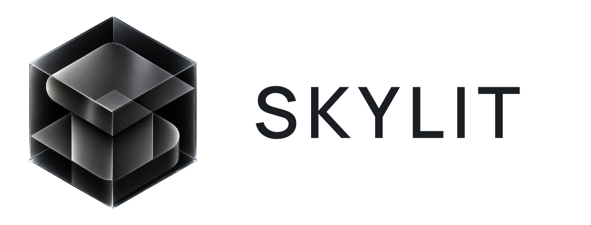

<p align="center">
  
</p>

<h1 align="center">Developer collaboration hub</h1>

<p align="center">
  Shared agents, APIs, and MCP projects built on Skylit.<br>
  <a href="https://www.skylit.ai">skylit.ai</a>
  ·
  <a href="https://docs.skylit.ai">Docs</a>
  ·
  <a href="https://www.skylit.ai/brand-assets">Brand library</a>
</p>

<p align="center">
  This repository is a shared shelf for the Skylit community. Members share AI agents, APIs, and MCP projects built on Skylit data. The account that hosts the repository holds the files. Each project belongs to the member who shared it.
</p>

<p align="center">
  Skylit exposes options-flow and dealer-positioning data through two surfaces that share one API key:
</p>

<p align="center">
  <a href="https://docs.skylit.ai/api-reference/introduction">REST API</a><br>
  <a href="https://docs.skylit.ai/mcp/overview">MCP server</a> at <code>https://mcp.skylit.ai/mcp</code>
</p>

<p align="center">
  Projects may use Heatseeker, Flowseeker, Tempest, or any combination of them.
</p>

## Members

The member list lives in [members/README.md](members/README.md). It is empty until the first project is merged.

A member's folder holds only that person's projects:

```text
members/
  alice/
    flow-sweep-agent/     kind: agent
    heat-proxy/           kind: api
  bob/
    gamma-wall-bot/       kind: agent
    tempest-tools/        kind: mcp
```

The folder name under `members/` is the Discord username. The folder under that is the project identifier.

## Share a project

1. Fork this repository and copy [templates/project/](templates/project/) to `members/<discord-username>/<project-id>/`.
2. Fill in the project README with your Discord username, project identifier, and kind (`agent`, `api`, or `mcp`).
3. Replace the project `LICENSE` file with the license you choose for your work.
4. On your first project, add `members/<discord-username>/README.md` and a link in the member index.
5. Open a pull request. Leave API keys and `.env` files out of the commit.

The full steps, folder rules, and checklist are in [CONTRIBUTING.md](CONTRIBUTING.md).

## How sharing works

Anyone can fork this public repository and open a pull request. That is the path for adding a project. Write access is for people who merge other members' work. A collaborator who can merge is still a collaborator. Shared ownership of the repository means a GitHub Organization with at least two Owners. Until this repository is transferred there, the personal account that hosts it is the current host.

Hub documentation and the blank template are dedicated under [CC0](LICENSE). A project under `members/` is covered only by the license file inside that project.

## Community files

- [CONTRIBUTING.md](CONTRIBUTING.md)
- [CODE_OF_CONDUCT.md](CODE_OF_CONDUCT.md)
- [SECURITY.md](SECURITY.md)
- [LICENSE](LICENSE)

The Skylit name and Satin Graphite lockup belong to Skylit, Inc. The files in [brand/](brand/) are the official horizontal lockup, used intact. This hub does not make a community project a Skylit product.
