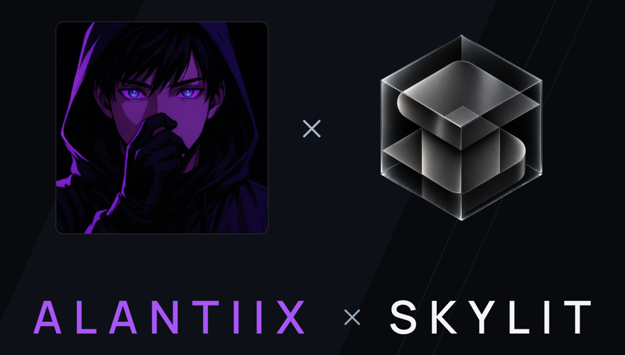

  

  Agent skills and knowledge bases for the Skylit Heatseeker methodology. 
  <a href="https://www.skylit.ai">skylit.ai</a>
  ·
  <a href="https://docs.skylit.ai">Docs</a>
  ·
  <a href="../README.md">Member index</a>

---

## Projects

| Project | Kind | What it does |
| --- | --- | --- |
| [skylit-academy-playbook-skill](skylit-academy-playbook-skill/README.md) | `agent` | Sanitized Agent Skill that grades setups and proposes ES/NQ/GC/SL plans using the Heatseeker methodology |
| [skylit-futures-strategy-engine](skylit-futures-strategy-engine/README.md) | `agent` | Deterministic Python engine that backtests and paper-trades the Heatseeker playbook on MES/MNQ from Skylit history |
| [skylit-knowledgebase](skylit-knowledgebase/README.md) | `agent` | Documentation and stage transcripts in Markdown, for training agents on the Skylit methodology |
